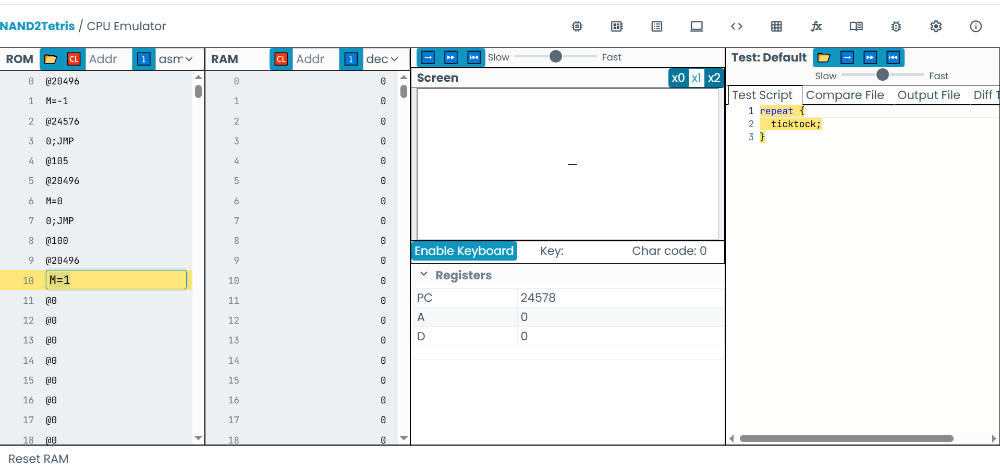

Error de código en actividad 3

Errores:
- El 0;JMP después del @24576 hace que no se lean las teclas y no se mueva nada.
- El @20496 no deja ver la línea horizontal.
- En HACK todo acceso a la memoria es @dirección + M
- Los saltos deben ir después de las comparaciones.

Imagen demostración corregida con movimiento a la derecha.

