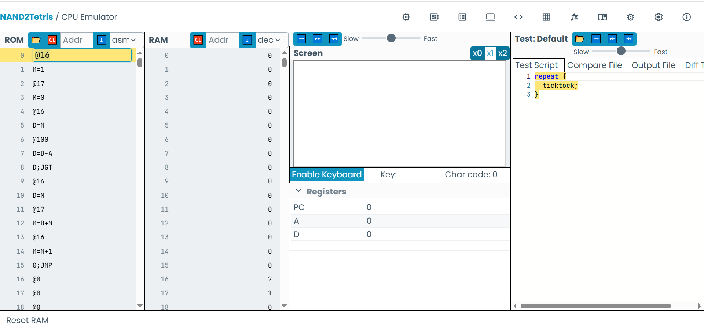

## Funcionamiento del código propuesto en la clase.

¿Por qué While y For son equivalentes?
- Son equivalentes porque tanto While como For realizan las mismas operaciones en el mismo orden: Inicializan una variable, verifican la condición, ejecutan el ciclo y actualizan las variables.