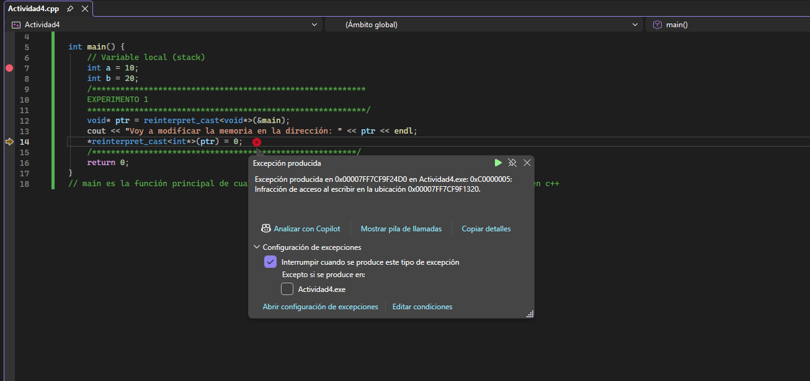
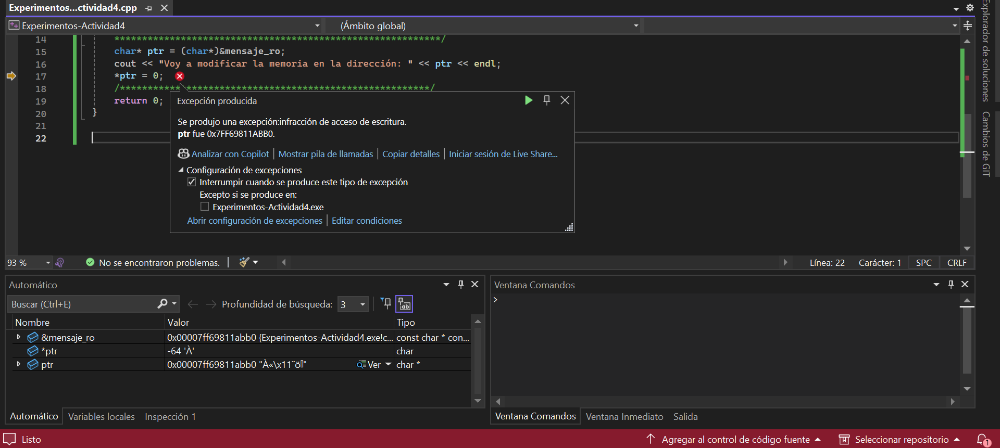
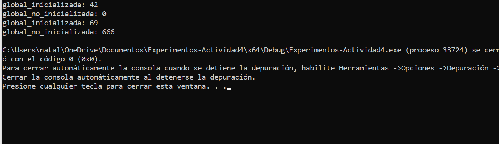
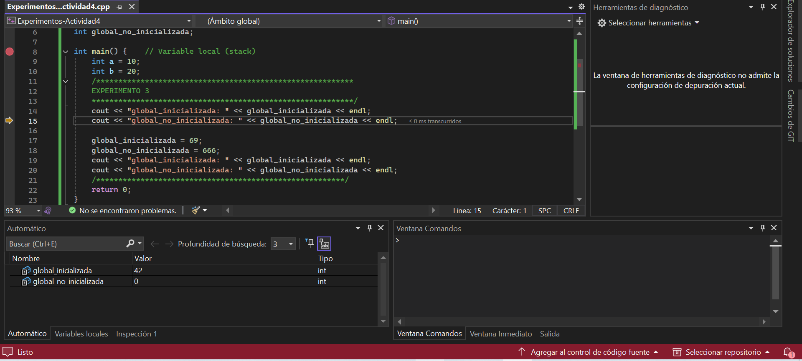
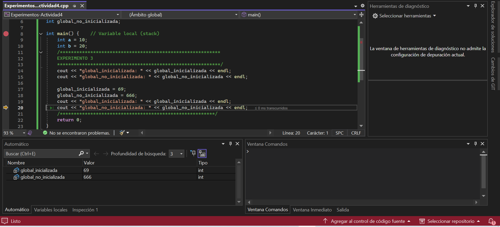
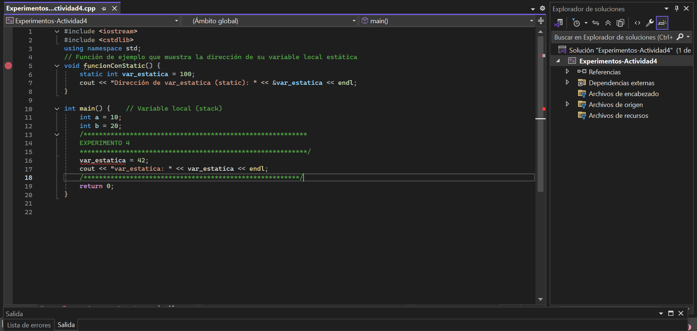
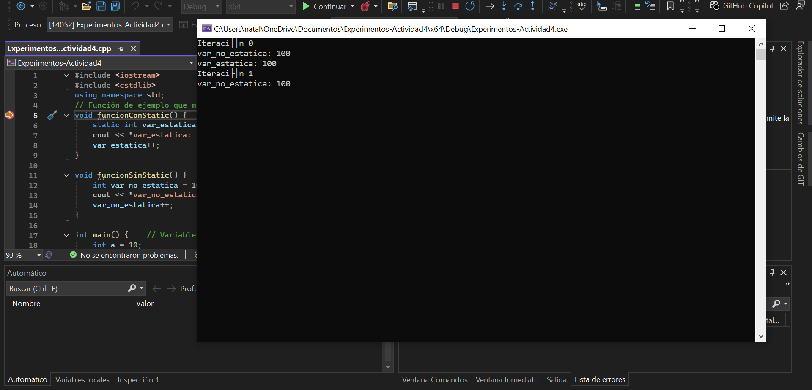
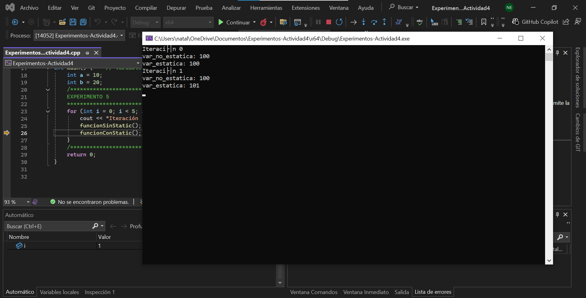
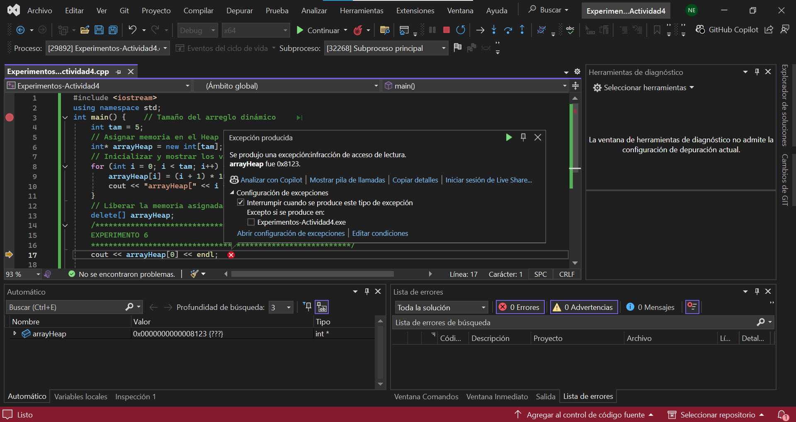

### **EXPERIMENTO 1**

```
#include <iostream>
#include <cstdlib>
using namespace std;

int main() {    
		// Variable local (stack)    
		int a = 10;    
		int b = 20;
    /**********************************************************        
    EXPERIMENTO 1    
    ***********************************************************/
    void* ptr = reinterpret_cast<void*>(&main);    
    cout << "Voy a modificar la memoria en la dirección: " << ptr << endl;    
    *reinterpret_cast<int*>(ptr) = 0;
    /********************************************************/
    return 0;
    }
```


+--------------------------------+
|TEXT:                           |
|int main                        |
+--------------------------------+
|DATA:                           |
|No hay                          |
+--------------------------------+
|HEAP:                           |
|No hay                          |
+--------------------------------+
|STACK:                          |
|a = 10                          |
|b = 20                          |
|return 0                        |
+--------------------------------+

 

  **¿Qué pasa?**
  El error aparece porque el puntero void*ptr quiere modificar el segmento de código TEXT, que es donde se almacenan las intrucciones del programa. Como esta zona de memoria es solo de lectura, el sistema operativo impide que se haga alguna modificación y por eso se genera el error.

  ### **EXPERIMENTO 2**

```
   #include <iostream>
#include <cstdlib>
using namespace std;
// Constante global
const char* const mensaje_ro = "Hola, memoria de solo lectura";

int main() {    
		// Variable local (stack)    
		int a = 10;    
		int b = 20;

    /**********************************************************        
    EXPERIMENTO 2    
    ***********************************************************/
    char* ptr = (char*)&mensaje_ro;    
    cout << "Voy a modificar la memoria en la dirección: " << ptr << endl;    
    *ptr = 0;
    /********************************************************/
    return 0;
    }
```

+--------------------------------+
|TEXT:                           |
|int main                        |
|"Hola, memoria  de solo lectura"|
+--------------------------------+
|DATA:                           |
|mensaje_ro                      |
+--------------------------------+
|HEAP:                           |
|No hay                          |
+--------------------------------+
|STACK:                          |
|a = 10                          |
|b = 20                          |
|ptr                             |
|return 0                        |
+--------------------------------+




### **¿Qué ocurre**
Aparece un error en la línea 17 (*ptr = 0) porque el puntero *ptr apunta a la variable global mensaje_ro que está ubicada en el DATA y al intentar modificar su contenido el programa genera un error porque se trata de la memoria que está solo en modo lectura.

### **EXPERIMENTO 3**

```
#include <iostream>
#include <cstdlib>
using namespace std;
// Variables globales
int global_inicializada = 42;
int global_no_inicializada;

int main() {    // Variable local (stack)    
		int a = 10;    
		int b = 20;
    /**********************************************************        
    EXPERIMENTO 3    
    ***********************************************************/
    cout << "global_inicializada: " << global_inicializada << endl;    
    cout << "global_no_inicializada: " << global_no_inicializada << endl;

    global_inicializada = 69;    
    global_no_inicializada = 666;
    cout << "global_inicializada: " << global_inicializada << endl;    
    cout << "global_no_inicializada: " << global_no_inicializada << endl;
    /********************************************************/
    return 0;
    }
```

+--------------------------------+
|TEXT:                           |
|int main                        |
+--------------------------------+
|DATA:                           |
|global_inicializada             |
|global_no_inicializada          |
+--------------------------------+
|HEAP:                           |
|No hay                          |
+--------------------------------+
|STACK:                          |
|a = 10                          |
|b = 20                          |
|return 0                        |
+--------------------------------+


Datos iniciales de las variables global_inicializada y global_no_inicializada:

Datos finales de las variables global_inicializada y global_no_inicializada:


### **¿Qué ocurre?**
En este experimento no aparece un error y el programa funciona correctamente porque las variables global_inicializada y global_no_inicializada hacen parte de la memoria DATA que puede ser modificada y también permiten la operación de lectura. Por eso en el código las variables pasan de ser 42 a 69 y 0 a 666 sin ningún tipo de error.

### **EXPERIMENTO 4**

```
#include <iostream>
#include <cstdlib>
using namespace std;
// Función de ejemplo que muestra la dirección de su variable local estática
void funcionConStatic() {    
		static int var_estatica = 100;    
		cout << "Dirección de var_estatica (static): " << &var_estatica << endl;
}

int main() {    // Variable local (stack)    
		int a = 10;    
		int b = 20;
    /**********************************************************        
    EXPERIMENTO 4    
    ***********************************************************/
    var_estatica = 42;
    cout << "var_estatica: " << var_estatica << endl;
    /********************************************************/    
    return 0;
    }
```

+--------------------------------+
|TEXT:                           |
|int main                        |
+--------------------------------+
|DATA:                           |
|funcionConStatic                |
|var_estatica                    |
+--------------------------------+
|HEAP:                           |
|No hay                          |
+--------------------------------+
|STACK:                          |
|a = 10                          |
|b = 20                          |
|return 0                        |
+--------------------------------+



### **¿Qué ocurre y por qué?**
Antes de intentar depurar el código aparece un error en var_estatica = 42 porque esta variable fue creada en otra función (funcionConStatic) lo que la hace una variable local que no existe dentro del main y que solo funciona dentro de la función que fue creada.
### **¿Qué pasa con las variables cada que entras y sales de la función?**
Cuando se entra a la funcionConStatic, la variable local var_estatica se almacena en la memoria estática y cuando se sale de la función la variable se borra de la memoria.
### **Qué pasa con las variables locales estáticas?**
Una variable local estática es una variable que se encuentra dentro de una función, pero no se borra cuando la función termina sino que guarda su valor en la memoria para la próxima vez que se utilice el código.

### **EXPERIMENTO 5**

```
#include <iostream>
#include <cstdlib>
using namespace std;
// Función de ejemplo que muestra la dirección de su variable local estática
void funcionConStatic() {    
		static int var_estatica = 100;    
		cout << "var_estatica: " << var_estatica << endl;    
		var_estatica++;
}
		
void funcionSinStatic() {    
		int var_no_estatica = 100;    
		cout << "var_no_estatica: " << var_no_estatica << endl;    
		var_no_estatica++;
}

int main() {    // Variable local (stack)    
		int a = 10;    
		int b = 20;
    /**********************************************************        
    EXPERIMENTO 5    
    ***********************************************************/
    for (int i = 0; i < 5; i++) {        
		    cout << "Iteración " << i << endl;        
		    funcionSinStatic();        
		    funcionConStatic();    
		}
    /********************************************************/
    return 0;
    }
```
+--------------------------------+
|TEXT:                           |
|int main                        |
+--------------------------------+
|DATA:                           |
|funcionConStatic                |
|var_estatica                    |
|var_no_estatica                 |
+--------------------------------+
|HEAP:                           |
|No hay                          |
+--------------------------------+
|STACK:                          |
|a = 10                          |
|b = 20                          |
|i                               |
|for                             |
|funcionSinStatic                |
|return 0                        |
+--------------------------------+





### **¿Qué ocurre? ¿Por qué?**
Al depurar el código, lo que sucede es que la funcionSinStatic imprime el valor de 100 en cada ciclo mientras que la funcionConStatic muestra los valores que van aumenatando de a uno según eñ contador de 100 a 104.
### **Ves alguna diferencia entre las variables locales estáticas y no estáticas?**
La diferencia es que las variables locales estáticas y no estáticas es que las variables estáticas se crean una sola vez en la función y conservan su valor independientemente si se sale de la función o no, mientras que las locales no estáticas no guardan su valor al salir de la función sino que se eliminan.
### **¿Qué pasa con las variables cada que entras y sales de la función?**
Cada que se entra a la función, las variables locales no estáticas se crean y al salir de la función se eliminan de la memoria Stack, mientras que las variables estáticas no se eliminan al salir de la función, sino que permanecen en la memoria Data y conservan su valor para poder ser cambiado cuando se vuelva a llamar la función.

### **EXPERIMENTO 6**

```
#include <iostream>
using namespace std;
int main() {    // Tamaño del arreglo dinámico    
		int tam = 5;
    // Asignar memoria en el Heap para un arreglo de enteros    
    int* arrayHeap = new int[tam];
    // Inicializar y mostrar los valores y direcciones de memoria    
    for (int i = 0; i < tam; i++) {        
		    arrayHeap[i] = (i + 1) * 10;        
		    cout << "arrayHeap[" << i << "] = " << arrayHeap[i] << " en dirección " << (arrayHeap + i) << endl;    
		    }
    // Liberar la memoria asignada en el Heap    
    delete[] arrayHeap;
    /**********************************************************        
    EXPERIMENTO 6    
    ***********************************************************/
    cout << arrayHeap[0] << endl;

    /********************************************************/
    return 0;
    }
```

+--------------------------------+
|TEXT:                           |
|int main                        |
|int* arrayHeap = new int[tam]   |
+--------------------------------+
|DATA:                           |
|No hay                          |
+--------------------------------+
|HEAP:                           |
|new int [tam]                   |
+--------------------------------+
|STACK:                          |
|tam = 5                         |
|arrayHeap                       |
+--------------------------------+



### **¿Qué ocurre? ¿Por qué?**
Aparece un error después de la línea de delete[] arrayHeap porque el delete se encarga de liberar el espacio de memoria que se reservó en el Heap cuando se hizo el for. Como cout << arrayHeap[0] << endl quiere ingresar a los datos de esa memoria aparece el error porque en la memoria Heap ya que no hay nada almacenado.
### **¿Qué diferencias notas entre el comportamiento y la gestión del Heap en comparación con el Stack?**
La memoria Stack maneja la memoria de forma automática porque las variables se crean cuando están dentro de una función y se eliminan cuando salen de ella. Mientras que en el Heap se necesita reservar el espacio de memoria usando new y se elimina usando delete.
### **¿Qué consecuencias tendría no liberar la memoria reservada con new?**
La memoria sigue ocupando espacio en el Heap aunque ya no se esté utilizando y eso puede hacer que se consuma memoria innecesaria que puede traer errores en el programa.
### **¿Por qué es importante usar delete[] al liberar memoria asignada para un arreglo?**
Porque es la forma correcta de liberar la memoria que se utilizo al crear el new y si no se utiliza correctamente, se podrían generar errores en el programa al no ser liberada la memoria del Heap correctamente.


