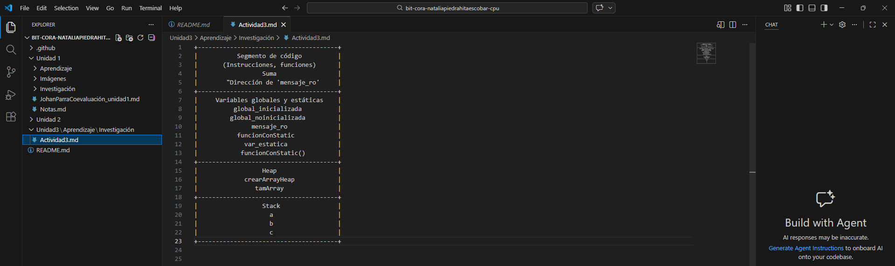

+---------------------------------------+
|           Segmento de código          |
|       (Instrucciones, funciones)      |
|                  Suma                 |
|        "Dirección de 'mensaje_ro'     |
+---------------------------------------+
|     Variables globales y estáticas    |
|          global_inicializada          |
|         global_noinicializada         |
|               mensaje_ro              |
|           funcionConStatic            |
|             var_estatica              |
|            funcionConStatic()         |
+---------------------------------------+
|                  Heap                 |
|             crearArrayHeap            |
|                tamArray               |
+---------------------------------------+
|                  Stack                |
|                    a                  |
|                    b                  |
|                    c                  |
+---------------------------------------+

