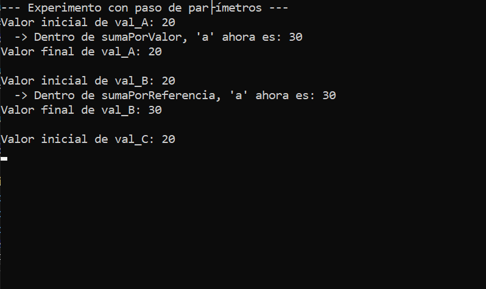
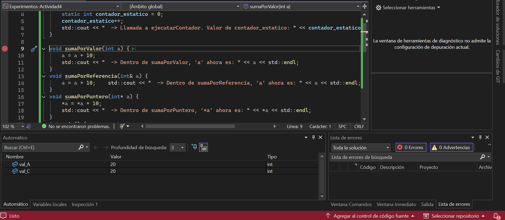
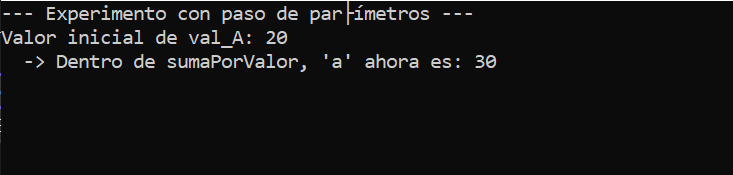
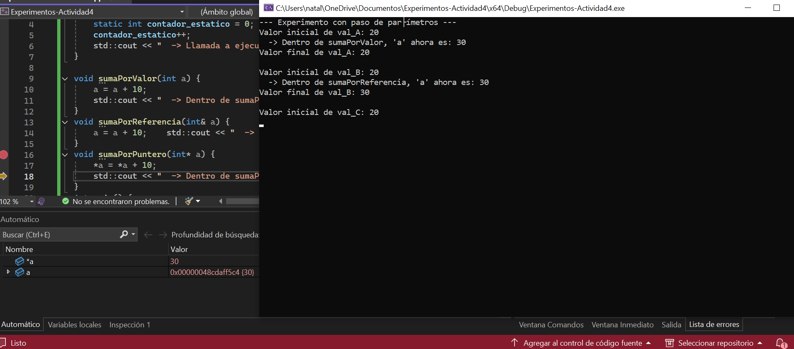
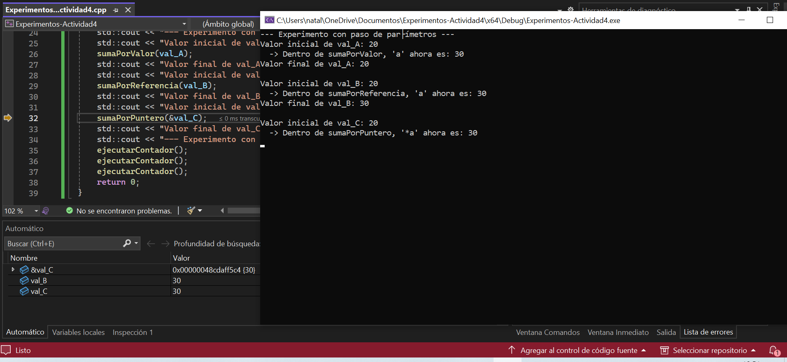
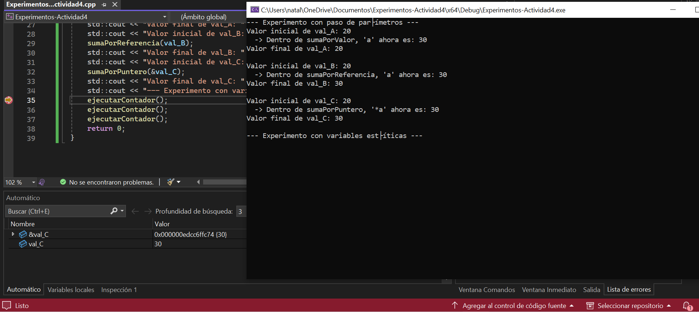
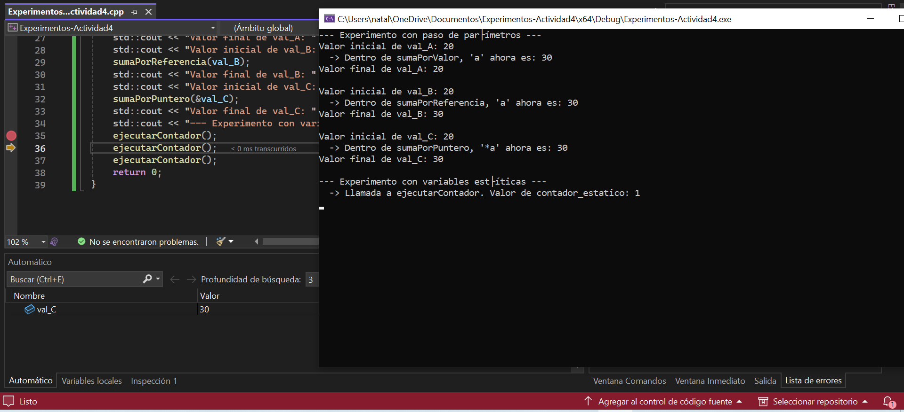
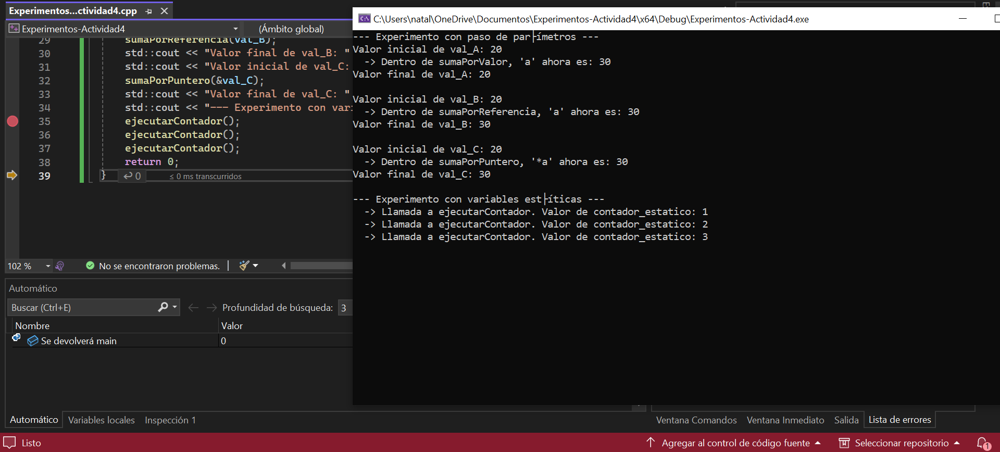
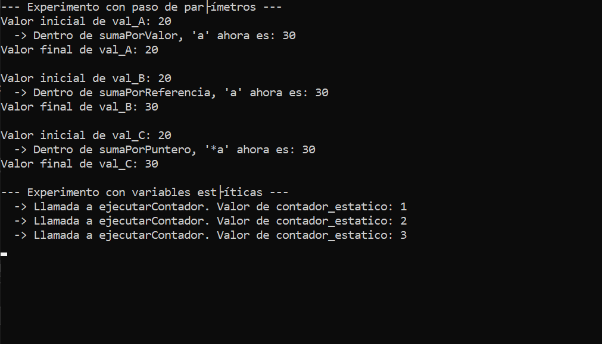

 Código
 ```
#include <iostream>
#include <string>
using namespace std;
class Punto {
		public:   string name;    
							int x;    
							int y;
    // Constructor    
    Punto(string _name, int _x, int _y) : name(_name),x(_x), y(_y) {        
		    cout << "Constructor: Punto "<< name <<" (" << x << ", " << y << ") creado." << endl;    
		    }
    // Destructor    
    ~Punto() {        
		    cout << "Destructor: Punto " << name << "(" << x << ", " << y << ") destruido." << endl;    
		    }
    // Método para imprimir valores    
    void imprimir() {        
		    cout << "Punto "<< name << "(" << x << ", " << y << ")" << endl;    
		    }
	};

int main() {    // Objeto original    
		Punto original("original",70, 80);    
		original.imprimir();    
		Punto* p = &original;
    // Copia del objeto    
    Punto copia = original;    
    copia.name = "copia";    
    copia.x = 100;    
    copia.y = 200;    
    copia.imprimir();    
    original.imprimir();
    p->name = "p";    
    p->x = 300;    
    p->y = 400;    
    p->imprimir();    
    original.imprimir();
    return 0;
    }
 ```

 ### **Explica qué ocurre al copiar un objeto en C++ y en C#. ¿Qué diferencias encuentras?**
- Cuando se copia un objeto en c++, se crea una copia independiente del objeto original, lo que hace que cualquier cambio que se le haga a la copia ni afecte el objeto original.

- En c#, al copiar un objeto no se crea una copia real, sino que tanto la copia como el original apuntan al mismo objeto en la memoria y esto hace que cualquier cambio realizado en la copia también afecte el original.

### **¿Qué es copia en C++ y en C#? ¿Es una copia independiente de la original?**
Una copia en c++ es un objeto nuevo que se crea en base al original, lo que sirve para que la copia funcione de manera independiente y cualquier cambio que se haga en esta no afecta a al objeto original. (Aquí si es una copia independiente a la original)

Una copia c# no es la creación de un objeto nuevo, sino que la copia también apunta al mismo objeto original y por eso es que al hacer cambios en la copia también se generan cambias en el objeto original. (Aquí no es una copia independiente de la original)

### **Actividad integradora de la investigación**

Código
```
#include <iostream>
int contador_global = 100;
void ejecutarContador() {    
		static int contador_estatico = 0;    
		contador_estatico++;    
		std::cout << "  -> Llamada a ejecutarContador. Valor de contador_estatico: " << contador_estatico << std::endl;
}

void sumaPorValor(int a) {    
		a = a + 10;    
		std::cout << "  -> Dentro de sumaPorValor, 'a' ahora es: " << a << std::endl;
}
void sumaPorReferencia(int& a) {    
		a = a + 10;    std::cout << "  -> Dentro de sumaPorReferencia, 'a' ahora es: " << a << std::endl;
}
void sumaPorPuntero(int* a) {    
		*a = *a + 10;    
		std::cout << "  -> Dentro de sumaPorPuntero, '*a' ahora es: " << *a << std::endl;
}
int main() {    
		int val_A = 20;    
		int val_B = 20;    
		int val_C = 20;
    std::cout << "--- Experimento con paso de parámetros ---" << std::endl;    
    std::cout << "Valor inicial de val_A: " << val_A << std::endl;    
    sumaPorValor(val_A);    
    std::cout << "Valor final de val_A: " << val_A << std::endl << std::endl;
    std::cout << "Valor inicial de val_B: " << val_B << std::endl;    
    sumaPorReferencia(val_B);    
    std::cout << "Valor final de val_B: " << val_B << std::endl << std::endl;
    std::cout << "Valor inicial de val_C: " << val_C << std::endl;    
    sumaPorPuntero(&val_C);    
    std::cout << "Valor final de val_C: " << val_C << std::endl << std::endl;
    std::cout << "--- Experimento con variables estáticas ---" << std::endl;    
    ejecutarContador();    
    ejecutarContador();    
    ejecutarContador();
    return 0;
}
```

### **Predicciones:**
**¿Cuál será la salida final en la consola de este programa?**
Valor final val_A = 20
Valor final val_B = 30
Valor final val_C = 30

**La salida completa:**
val_A = SumaPorValor
val_A = 20
SumaPorValor: a + 10 = 30 (Se guarda en una copia)
Valor final val_A = 20 porque se crea una copia que no afecta el valor inicial de val_A.

val_B = SumaPorReferencia
val_B = 20
SumaPorReferencia: a + 10 = 30 (Se hace la operación directamente en el val_B)
Valor final val_B = 30 afecta el valor inicial de la variable porque la modifica inmediatamente y no genera una copia.

val_C = SumaPorPuntero
val_C = 20
SumaPorPuntero 
*val_C = 20 (se crea el puntero)
*a + 10 = 30
val_C = 30 porque el puntero modifica el valor inicial

+--------------------------------+
|TEXT:                           |
|int main                        |
|sumaPorValor                    |
|sumaPorReferencia               |
|sumaPorPuntero                  |
+--------------------------------+
|DATA:                           |
|contador_global                 |
|contador_estatico               |
+--------------------------------+
|HEAP:                           |
|No hay                          |
+--------------------------------+
|STACK:                          |
|val_A                           |
|val_B                           |
|val_C                           |
|a                               |
+--------------------------------+

### **Verificación y análisis**
**Puntos de interés:** 
La declaración de las variables


Cuando se llaman las funciones (La suma)



El puntero



El contador estático




**¿Qué demuestran las capturas de pantalla?**

- Se demuestra que con la SumaPorValor la variable inicial no cambia al realizar la suma porque se creó una copia de esta.

- Se demuestra que con la SumaPorReferencia la variable inicial si cambia al hacer la suma porque esta se realiza en la variable incial.

- Se demuestra con la SumaPorPuntero que al crear un puntero la variable incial no se cambia porque
 al hacer la suma se coloca el valor final en el puntero y no en la variable inicial.

 **Comportamiento del contador_estatico**
 El contador_estatico no se reinicia cada vez que se llama a la función, sino que mantiene el mismo valor que tenía antes. Esto sucede porque el contador no se elimina cuando la función termina sino que se vuelve a ejecutar.
 La diferencia del contador con una variable local normal es que la variable local se crea dentro de la función y se elimina cuando se sale de esta y el contador siemore vuelve a empezar desde su valor inicial.