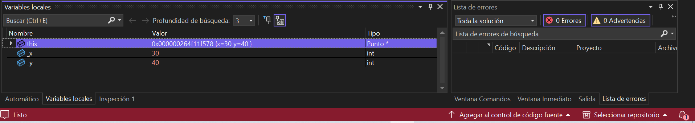
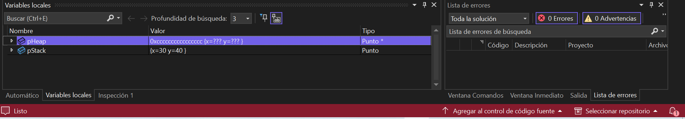

Código

```
#include <iostream>
using namespace std;
class Punto {
		public:    int x;    int y;
    // Constructor    
    Punto(int _x, int _y) : x(_x), y(_y) {        
		    cout << "Constructor: Punto(" << x << ", " << y << ") creado." << endl;    
		    }
    // Destructor    
    ~Punto() {        
		    cout << "Destructor: Punto(" << x << ", " << y << ") destruido." << endl;    
		    }
    // Método para imprimir valores    
    void imprimir() {        
		    cout << "Punto(" << x << ", " << y << ")" << endl;    
		    }
		};
int main() {    
		// Objeto en el stack    
		Punto pStack(30, 40);    
		pStack.imprimir();
    // Objeto en el heap    
    Punto* pHeap = new Punto(50, 60);    
    pHeap->imprimir();
    // Coloca breakpoints en la creación de pStack y pHeap    
    // Inspecciona las direcciones de memoria de ambos objetos:    
    // - pStack: dirección obtenida directamente.    
    // - pHeap: la variable pHeap es un puntero que contiene la dirección del objeto en el heap.
    // Recuerda liberar la memoria del heap    
    delete pHeap;
    return 0;
}
```

**Direcciones de memoria**
pStack: Es un objeto creado en el Stack y su dirección de memoria se asigna automáticamente.


pHeap: Es un puntero que contiene la dirección de un objeto creado en el Heap usando new.


**pStack ¿Es un objeto o una referencia a un objeto?**
Es un objeto porque está almacenado en el Stack y su memoria se gestiona automáticamente.

**pHeap ¿Es un objeto o una referencia a un objeto? Si es una referencia, ¿A qué objeto hace referencia?**
Es una referencia. 
pHeap es un puntero que almacena la dirección de un objeto creado en el Heap (Punto* pHeap = new punto(50,60)). El objeto reside en Heap, y la memoria debe ser liberada con delete.

**¿Qué observas? ¿Qué significa esto?**
Al mirar pHeap en memory1 se ve la dirección de la memoria del objeto en el Heap y al mirar &pHeap se ve la dirección del puntero en el stack.