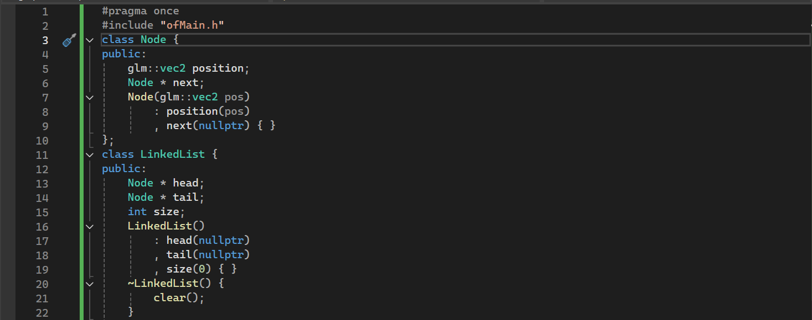
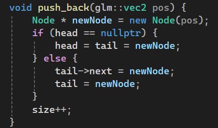
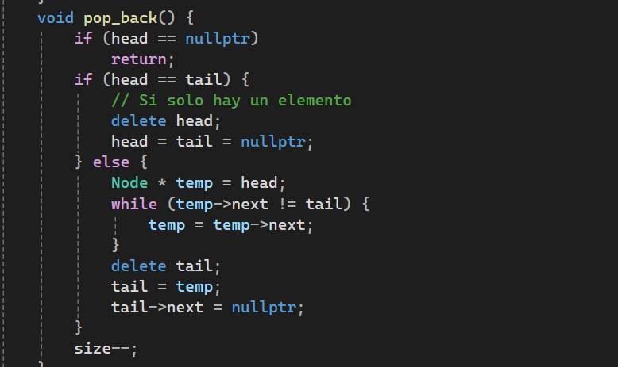
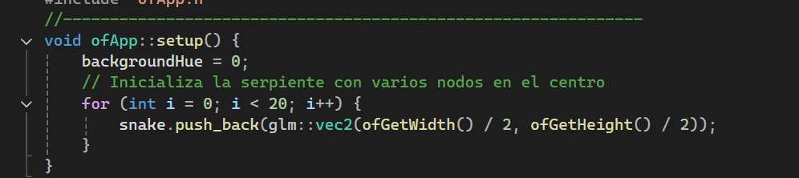
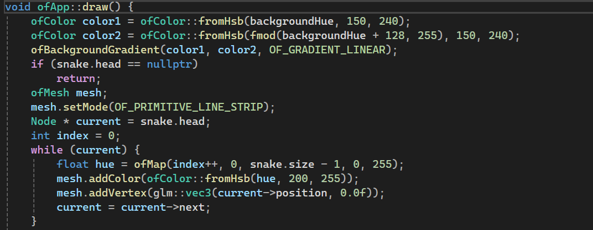
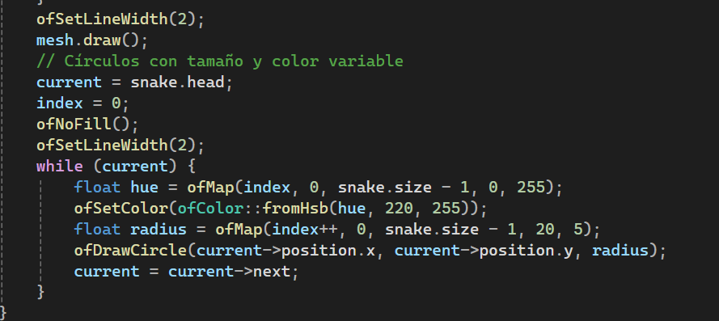
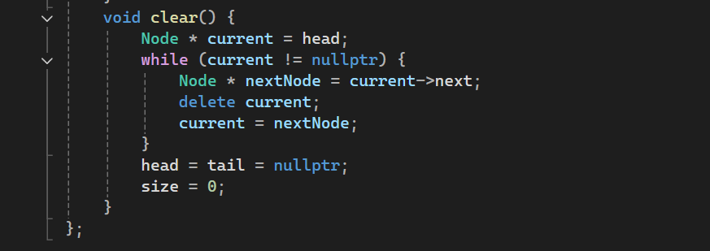

### **ofApp.h**
**Predicciones**

1. Se crean los nodos en forma de vectores para formar una lista donde vaya uno detrás del otro.

2. Se crea el push_back que crea un puntero en la cola del nodo que sirve para apuntar a la cabeza del siguiente nodo si hay uno, y si no, muestra que ahí se termina la secuencia de nodos. (Null)
Cada nuevo nodo que se agrega por medio de la tecla "a" a la cola va aumentando de tamaño.

3. pop_back: Hace que se eliminen de uno a uno los nodos, solo elimina el último nodo que se encuentra en la cola cada vez que se presiona la tecla "r"

4. setup: Hace que se empiece el código con varios nodos creados en el centro de color rojo.

5. update: 

6. draw: Ayuda a generar los colores que tendrán tanto los nodos como el fondo.

ofBackgroundVarient --- cra los colores del fondo, mostrando que se crean dos colores por separado que cambian de gradiente cada vez que la cola de nodos cambia de lugar.

OfSetLineWidth --- crea la gradiente de colores que tendrán los nodos a medida que se van aumentando, sumándole a la gradiente 0 inicial un 1 para que el color vaya cambiando de forma constante.

7. Si se quiere limpiar la cola de nodos creados se apreta la tecla c para eliminar todos los nodos.

