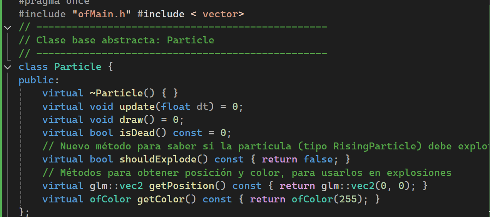

### **ofApp.h**

En el código las partículas aparecen desde la parte de abajo la ventana, se pueden mover y luego explotan de diferentes maneras.

1. Se crea una  clase abstracta Partícula, que funciona como plantilla general.
Esta clase tiene las funciones:
update(): Que va actualizando el estado en el que se encuentra la partícula.
draw(): Dibuja la partícula en la ventana.
isDead(): Muestra el estado cuando ya explotó la partícula.
shouldExplode(): Es el método que se usa para saber si la partícula va a explotar.
getPosition(): Es el método que sirve para decir la posición en la que se encuentra la partícula.
getColor(): Método que define el color de la partícula al aparecer en la ventana.

2. Luego se crea la clase RisingParticle que es la partícula que se verá en la ventana y que es la que aparece en la parte de abajo de la ventana al activar el código. Esta clase hereda todas las cualidades de la clase Partícula y define el tiempo máximo que pasará la partícula en pantalla antes de explotar.
