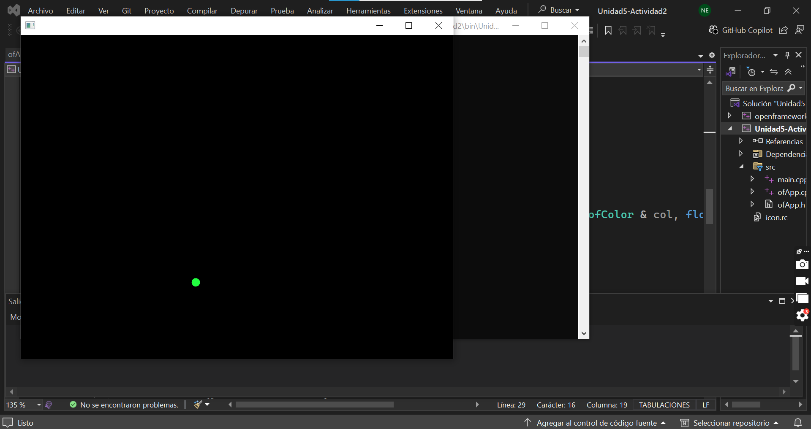
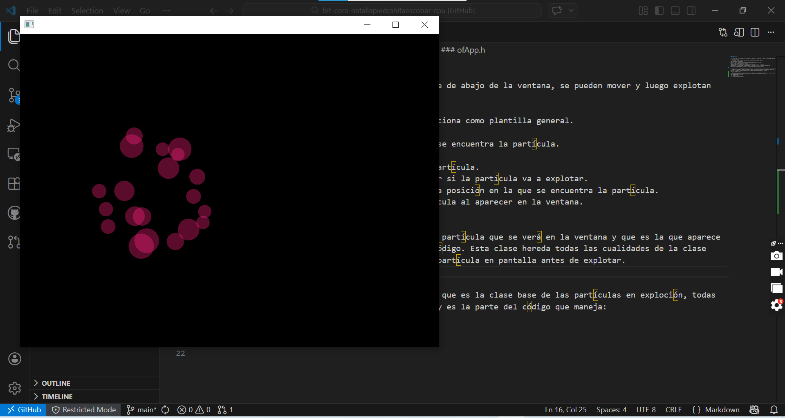
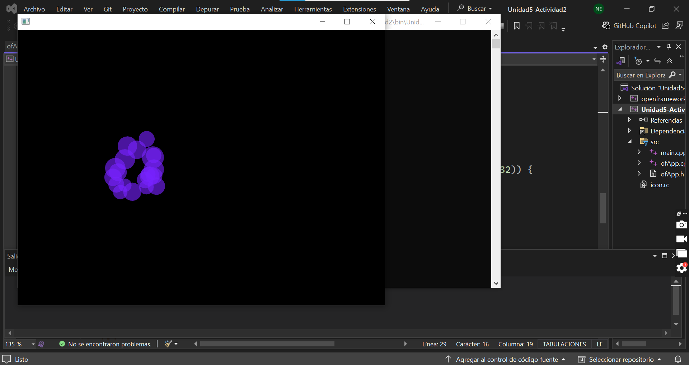
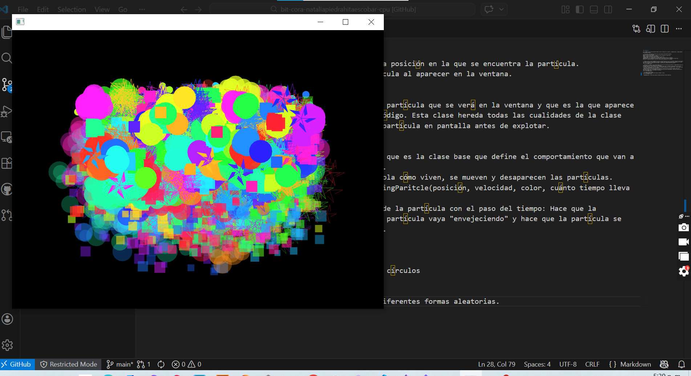
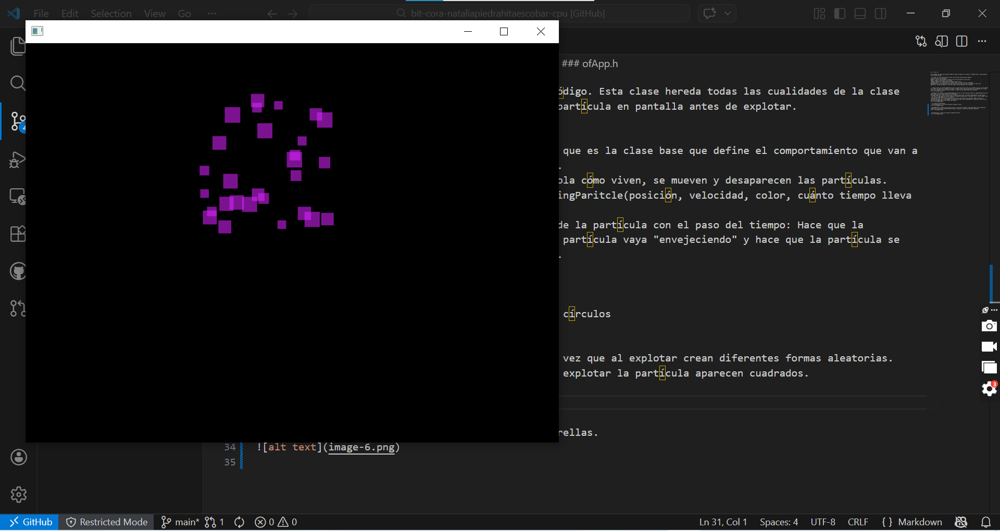
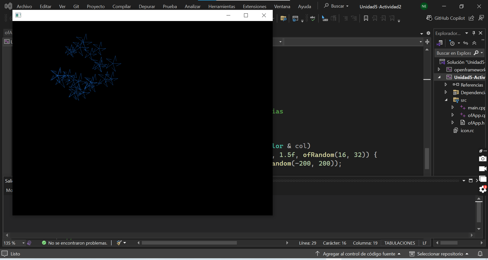

### **ofApp.h**

En el código las partículas aparecen desde la parte de abajo de la ventana, se pueden mover y luego explotan de diferentes maneras.

1. Se crea una  clase abstracta Partícula, que funciona como plantilla general.
Esta clase tiene las funciones:
update(): Que va actualizando el estado en el que se encuentra la partícula.
draw(): Dibuja la partícula en la ventana.
isDead(): Muestra el estado cuando ya explotó la partícula.
shouldExplode(): Es el método que se usa para saber si la partícula va a explotar.
getPosition(): Es el método que sirve para decir la posición en la que se encuentra la partícula.
getColor(): Método que define el color de la partícula al aparecer en la ventana.

2. Luego se crea la clase RisingParticle que es la partícula que se verá en la ventana y que es la que aparece en la parte de abajo de la ventana al activar el código. Esta clase hereda todas las cualidades de la clase Partícula y define el tiempo máximo que pasará la partícula en pantalla antes de explotar.

3. Aparece en el código la clase ExplosionParticle que es la clase base que define el comportamiento que van a tener todas las partículas después de la explosión.
No dibuja nada por sí sola la clase, pero si controla cómo viven, se mueven y desaparecen las partículas.
- Contiene los atributos de las partículas del RisingParitcle(posición, velocidad, color, cuánto tiempo lleva viva, cuánto tiempo puede vivir y el tamaño).
- update(float dt): Es el que actualiza el estado de la partícula con el paso del tiempo: Hace que la partícula se mueva según su velocidad, hace que la partícula vaya "envejeciendo" y hace que la partícula se vaya desvaneciendo poco a poco después de explotar.

4. Los tipos de explosiones:
- CircularExplosion: La partícula explota formando círculos

- RandomExplosion: Aparecen varias partículas a la vez que al explotar crean diferentes formas aleatorias.
También hay una forma de random explosion donde al explotar la partícula aparecen cuadrados.

- StarExplosion: La partícula explota formando estrellas.

### **ofApp.cpp**
Es la parte del código donde se controla la creación, actualización, explosión y eliminación de todas las partículas.
1. update(): Es donde se actualizan las partículas y se muestra si se están moviendo, envejeciendo o desvaneciendo.
- En caso de que la partícula explote, esta parte del código elige el tipo de explosión y luego crea las diferentes partículas que aparecen después de esta.
Las nuevas partículas que aparecen después de la explosión nacen en la misma posición de la explosión, con el mismo color y desaparecen al tiempo.
2. Draw(): Es la parte del código que se encarga de dibujar las partículas en la pantalla (Círculos, cuadrados y estrellas).
3. createRisingParticle(): Aquí es donde se crea la partícula inicial que sale de la parte inferior de la pantalla, crea los vectores de posición incial de las partículas, define la velocidad, el color y cuándo explota la partícula.
