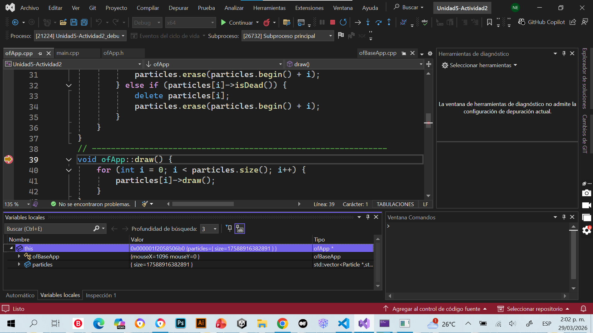
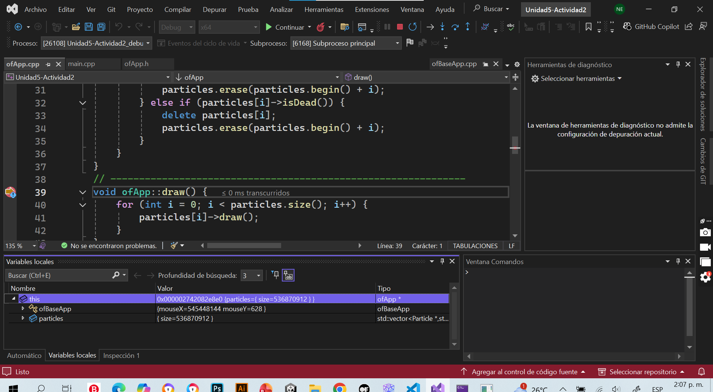
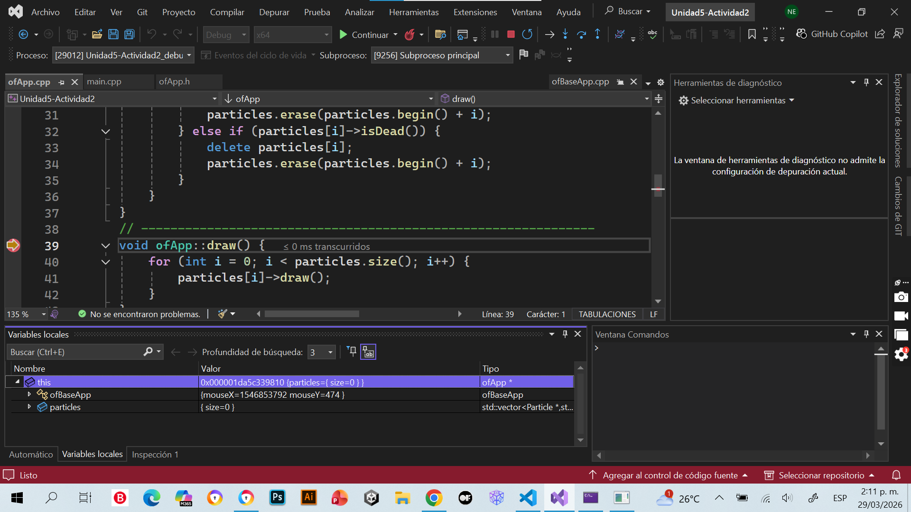
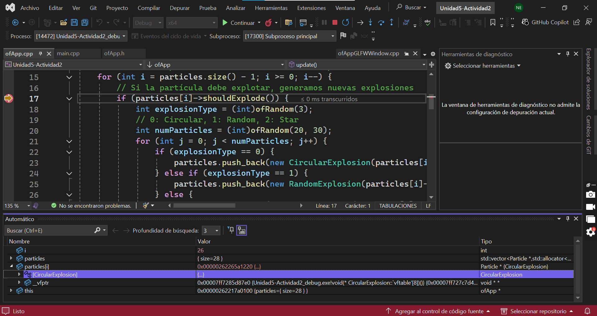
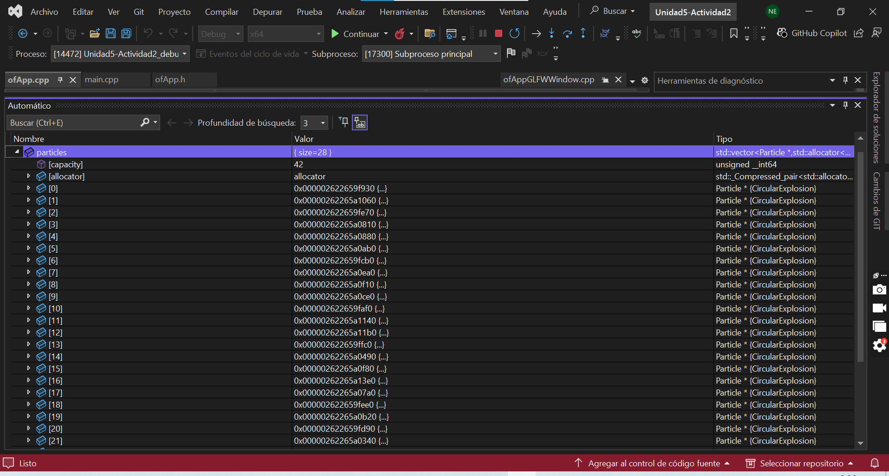
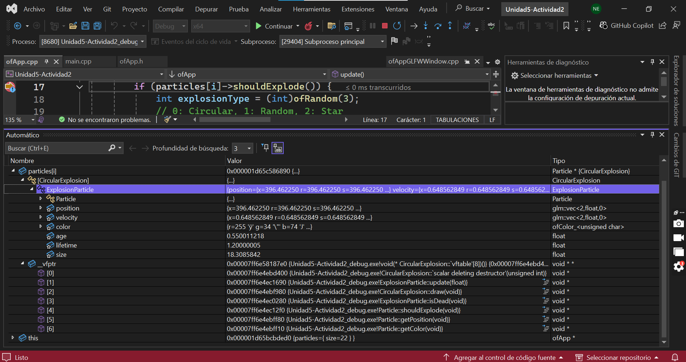
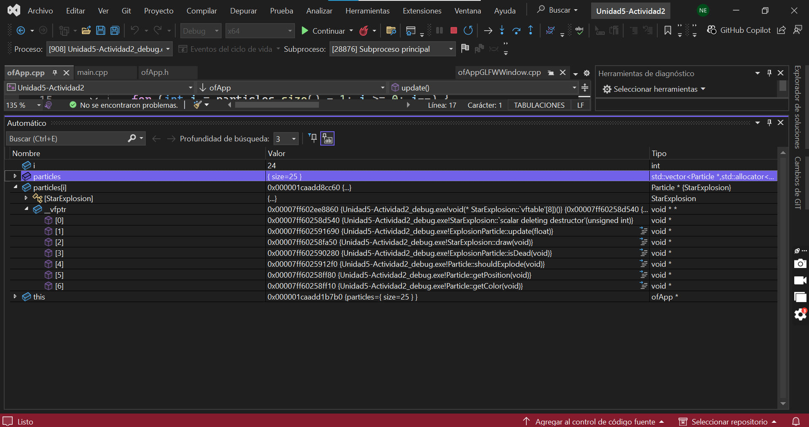
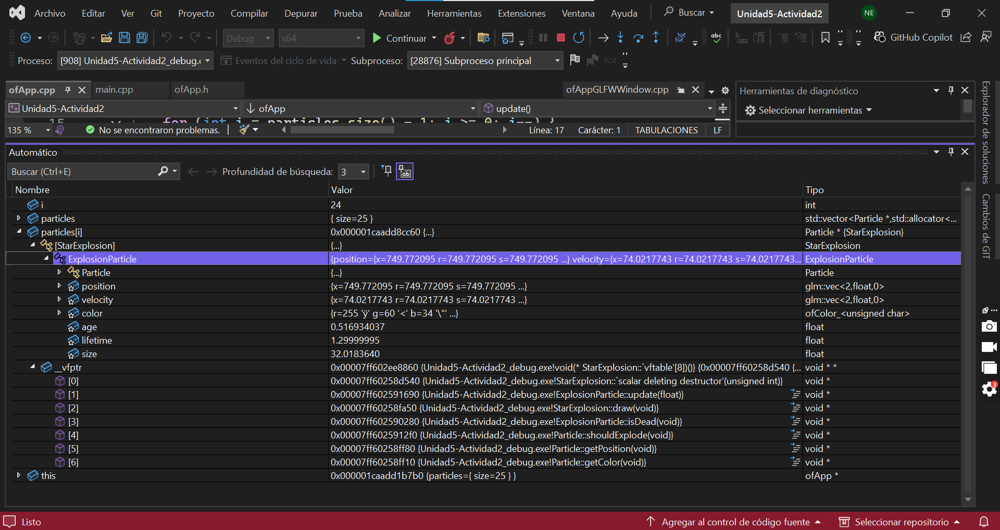

### **¿Qué espero ver en la memoria?**
Creo que va a mostrar el preceso interno del espacio de memoria donde se encuentra ofApp, o sea, cuando se crea la partícula, ver sus movimientos, posición, velocidad y la forma en la que explotan. O sea, ver cómo se guardan esos procesos en la memoria y cómo funcionan.

**Ejecuta el código y muestra una captura de pantalla del objeto en la memoria. ¿Qué puedes observar? ¿Qué información te proporciona el depurador? ¿Qué puedes concluir?**

Depuración cuando se crean varias partículas al incio:



 Depuración cuando se crea una sola partícula al inicio:
 

Al depurar el código, se puede ver el objeto ofApp en la memoria a través de las variables this y su atributo particles.

El depurador también muestra el tamaño del vector de la partícula cuando es lanzada, la dirección en la memoria y la posición en el mouse.

En una de las capturas, cuando solo se creó una sola partícula, el tamaño del vector es muy pequeño (0), mientras que en la captura donde se crearon varias partículas a la vez, el tamaño aparece demasiado grande lo cual es un error. El error sucede porque se están borrando elementos del vector mientras se está utilizando, lo que hace que el programa siga leyendo posiciones que ya no existen y la memoria se desordena.

### **CircularExplosion en la memoria**




**¿Qué puedes observar en la memoria? ¿Qué información te proporciona el depurador? ¿Qué puedes concluir?**

1. En la memoria se puede observar que en el vector Particles hay 28 partículas y que cada una está guardada en un puntero. Todas las partículas apuntan al CirculasExplosion y cada una de ellas se encuentra en una dirección diferente de la memoria.

2. El depurador ayuda a mostrar cuántas partículas hay, sus direcciones en memoria y el tipo real del objeto que hay cuando sucede el CircularExplosion.

3. Se puede concluir que aunque el vector guarde las particulas como punteros, en realidad son objetos como el CircularExplosion. O sea que,aunque el programa guarda los objetos de distintos tipos como si fueran iguales, en realidad son diferenrtes y el programa sabe cuál es cuál.

### **Métodos Virtuales**

**CircularExplosion _vfptr:**


**¿Qué puedo observar?**

Puedo observar que _vtable contiene las direcciones de memoria que representan a las funciones del objeto como update, draw, etc.

**StarExplosion _vfptr:**



**TABLA COMPARATIVA: ¿Qué puedes ver? ¿Qué puedes concluir? ¿Qué relación existe entre la tabla de funciones y los métodos virtuales?**

1. Se puede ver que las tablas son parecidas, ya que tienen las mismas funciones como update, draw e isDead. Pero diferencian en que cada clase tiene su propia implementación de estas funciones. O sea que, la función draw va a ser diferente tanto en el CircleExplosion como en el StarExplosion y así sería lo mismo con las demás funciones que poseen.

2. Se puede concluir que aunque las clases heredan de las misma base, cada una tiene una tabla de funciones diferentes, lo que permite que cada objeto ejecute sus propios métodos aunque se manejen con el mismo tipo Particle*.

3. La relación de los _vtable con los métodos virtuales es que los _vtable existen gracias a los métodos virtuales. Es lo que permite que el programa sepa qué función utilizar dependiento del tipo de objeto.


**Código**
```
using System;
interface IAnimal{    
		void HacerSonido();
		}
class Perro : IAnimal{    
		public void HacerSonido()    {        
				Console.WriteLine("El perro ladra: ¡Guau, guau!");    
				}
		}
class Gato : IAnimal{    
		public void HacerSonido()    {        
				Console.WriteLine("El gato maúlla: ¡Miau, miau!");    		
				}
		}
class Program{    
		static void Main()    {        
				// Polimorfismo: Usamos la interfaz para tratar diferentes tipos de animales        
				IAnimal[] animales = new IAnimal[]{            
						new Perro(),            
						new Gato()        
						};
        foreach (IAnimal animal in animales){            
		        animal.HacerSonido(); 
		        // Llamada polimórfica        
		        }    
		    }
}
```
### **¿Para qué sirve una una tabla de funciones virtuales**

Creo que sirve para que cada objeto se ejecute con su propia función, así parezca que las funciones son del mismo tipo. 

**¿Cómo se logra esto? ¿Qué relación existe entre los métodos virtuales y el polimorfismo? Al llamar HacerSonido cómo sabe esta función sobre cuál objeto debe actuar?**

1. La tabla de funciones virtuales funciona gracias al polimorfismo porque aunque los objetos (IAnimal, Particle*) se guarden como un mismo tipo, cada uno tiene una forma diferente de usar las funciones.

2. La relación es que los métodos virtuales permiten el polimorfismo. Gracias al polimorfismo es que el programa puede decidir en el tiempo real de ejecución qué función es la que debe utilizar.

3. La función HacerSonido sabe qué objeto utilizar porque cada objeto tiene su propia información interna (como la _vtable) que permite que el programa sepa qué función debe utilizar.