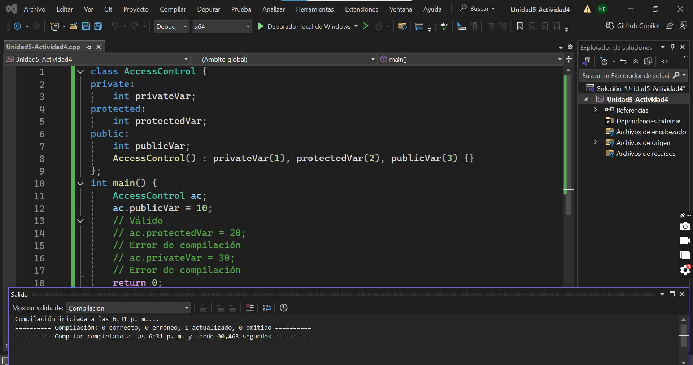
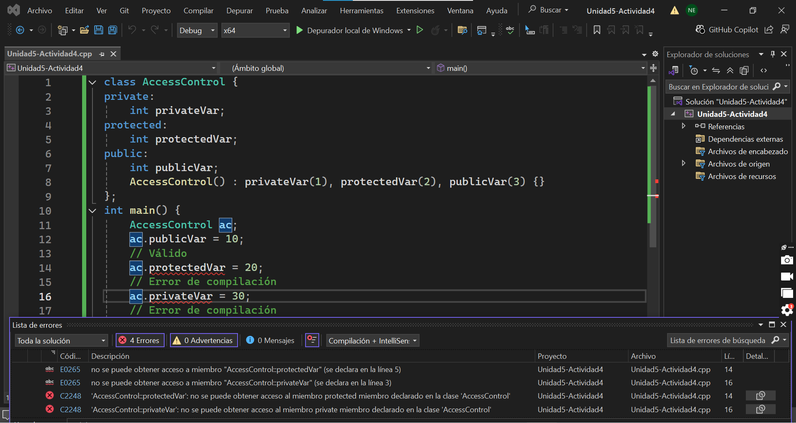
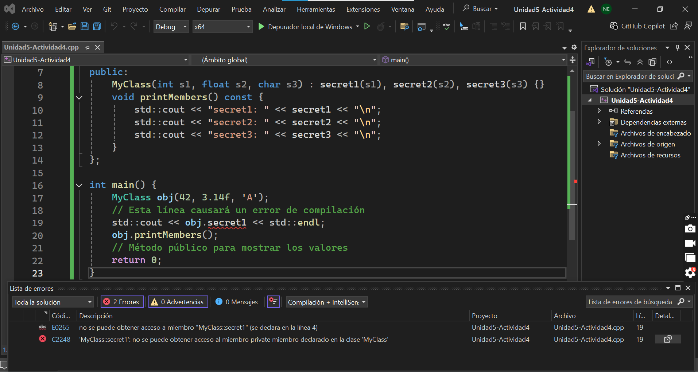
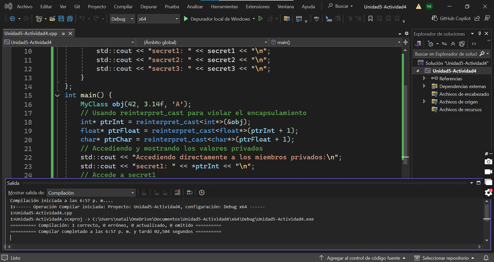

### **Código**
```
class AccessControl {
private:
	int privateVar;
protected:
	int protectedVar;
public:
	int publicVar;
	AccessControl() : privateVar(1), protectedVar(2), publicVar(3) {}
};
int main() {
	AccessControl ac;
	ac.publicVar = 10;
	// Válido    
	// ac.protectedVar = 20; 
	// Error de compilación    
	// ac.privateVar = 30; 
	// Error de compilación    
	return 0;
}
```

Código normal compilado:


Código descomentado y compilado:


**¿Qué sucede? ¿Por qué sucede esto? ¿Qué puedes concluir?**

1. Lo que sucede es que al descomentar las líneas ac.protectedVar = 20 y ac.privateVar = 30, aparece un error de compilación. Solo se puede modificar publicVar, pero no protectedVar ni privateVar.

2. Esto sucede porque las variables cuentan con diferentes niveles de acceso. PublicVar es una variable pública y se puede usar desde el main, pero protectedVar y privateVar son variables a las que no se puede acceder desde afuera de la clase.

3. Con este ejercicio se puede concluir que el encapsulamiento sirve para proteger los datos de una clase y controlar qué se puede usar desde afuera. 

**Código**
```
#include <iostream>
class MyClass {
private:    
		int secret1;    
		float secret2;    
		char secret3;
public:    
		MyClass(int s1, float s2, char s3) : secret1(s1), secret2(s2), secret3(s3) {}
    void printMembers() const {        
		    std::cout << "secret1: " << secret1 << "\n";        
		    std::cout << "secret2: " << secret2 << "\n";        
		    std::cout << "secret3: " << secret3 << "\n";    
		    }
		};

int main() {    
		MyClass obj(42, 3.14f, 'A');    
		// Esta línea causará un error de compilación    
		std::cout << obj.secret1 << std::endl;
    obj.printMembers();  
    // Método público para mostrar los valores    
    return 0;
    }
```

**¿Qué pasa al compilar el programa?**


Al compilar el programa se genera un error porque se está intentado acceder a una variable privada, que es secret1, desde afuera de la clase. El compilador no deja que esto suceda porque el encapsulamiento está protegiendo los datos.

**Código**
```
#include <iostream>
class MyClass {
private:    
		int secret1;    
		float secret2;    
		char secret3;
public:    
		MyClass(int s1, float s2, char s3) : secret1(s1), secret2(s2), secret3(s3) {}
    void printMembers() const {        
		    std::cout << "secret1: " << secret1 << "\n";        
		    std::cout << "secret2: " << secret2 << "\n";        
		    std::cout << "secret3: " << secret3 << "\n";    
		    }
		};
int main() {    
		MyClass obj(42, 3.14f, 'A');
    // Usando reinterpret_cast para violar el encapsulamiento    
    int* ptrInt = reinterpret_cast<int*>(&obj);    
    float* ptrFloat = reinterpret_cast<float*>(ptrInt + 1);    
    char* ptrChar = reinterpret_cast<char*>(ptrFloat + 1);
    // Accediendo y mostrando los valores privados    
    std::cout << "Accediendo directamente a los miembros privados:\n";    
    std::cout << "secret1: " << *ptrInt << "\n";       
    // Accede a secret1    
    std::cout << "secret2: " << *ptrFloat << "\n";     
    // Accede a secret2    
    std::cout << "secret3: " << *ptrChar << "\n";      
    // Accede a secret3
    return 0;
    }
```
 
 **¿Qué sucede al compilar el programa?**
 

 En este caso el programa si se compila y muestra los datos privados porque  accede a la memoria por medio de punteros, lo que hace que se eviten las restricciones del compilador y se salte el encapsulamiento.

 ### **¿Qué es el encapsulamiento? ¿Por qué es importante?**

 Es la forma de agrupar datos a una clase para ofrecerles cierto nivel de protección donde no cualquier persona pueda acceder a ellos para editarlos o modificarlos.

 El encapsulamiento es importante porque ayuda a proteger los datos del objeto para que el código sea más seguro y fácil de mantener.