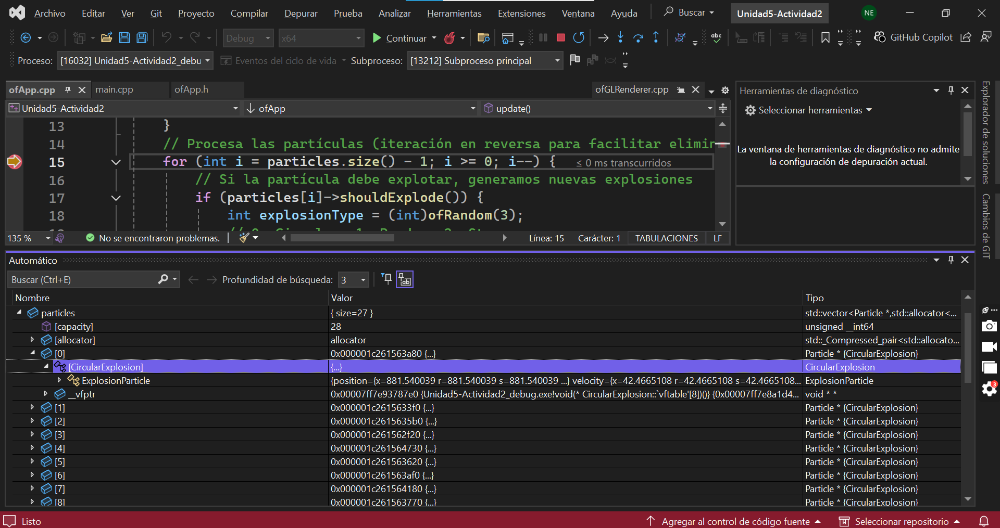
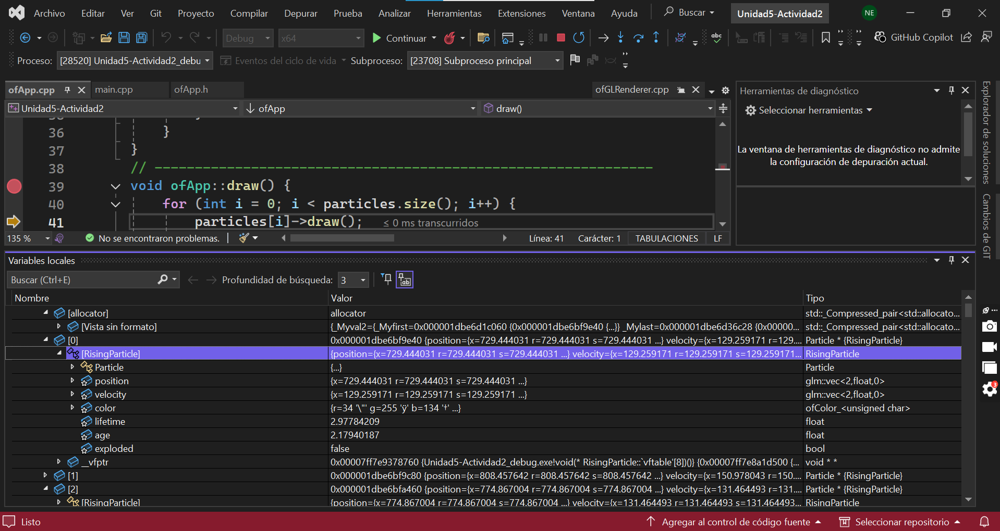
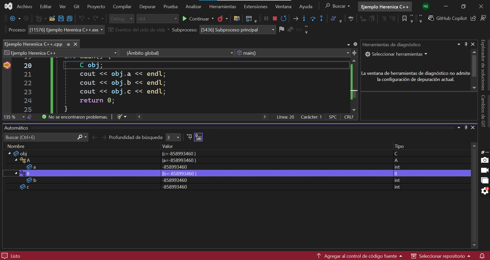

 (Explosión Circular)
 (Varias partículas explotan a la vez)

### **¿Qué puedes observar?**
Al observar en la memoria del objeto CircularExplosion, se ven los datos de la clase y también los datos heredados de ExplosionParticle y Particle

### **¿Qué información te proporciona el depurador?**
El depurador permite ver los valores que hay en cada atributo y cómo todos forman un solo objeto de memoria.

### **¿Qué puedes concluir?**
Se puede concluir que en C++, la herencia hace que un bojeto incluya en la memoria los atributos de sus clases base.

### **¿Cómo se implementa la herencia en C++?**
Para usar la herencia en C++ se utiliza : seguidos de la clase base.

Para acceder a algo de una clase se usa ::

**EJEMPLO HERENCIA:**

class CircularExplosion : public ExplosionParticle

### **Realiza un experimento que te permita ver cómo se ve un objeto en memoria cuya clase base tiene herencia múltiple.**

En este ejemplo se crean dos clases A y B donde cada una tiene una variable diferente y luego se crea la Clase C que es la que va a heredar de la clase A y de la B.

```
#include <iostream>
using namespace std;

class A {
public:
    int a = 1;
};

class B {
public:
    int b = 2;
};

class C : public A, public B {
public:
    int c = 3;
};

int main() {
    C obj;
    cout << obj.a << endl;
    cout << obj.b << endl;
    cout << obj.c << endl;
    return 0;
}
```


Al colocar el breakpoint en C obj y revisar el depurador, se puede ver que la clase C contiene los atributos de las clases A y B junto con los suyos propios, lo que demuestra cómo funciona la herencia múltiple en C++