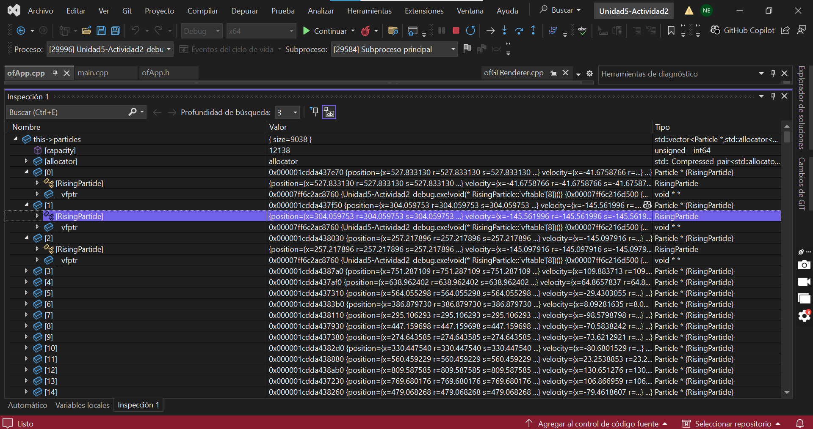
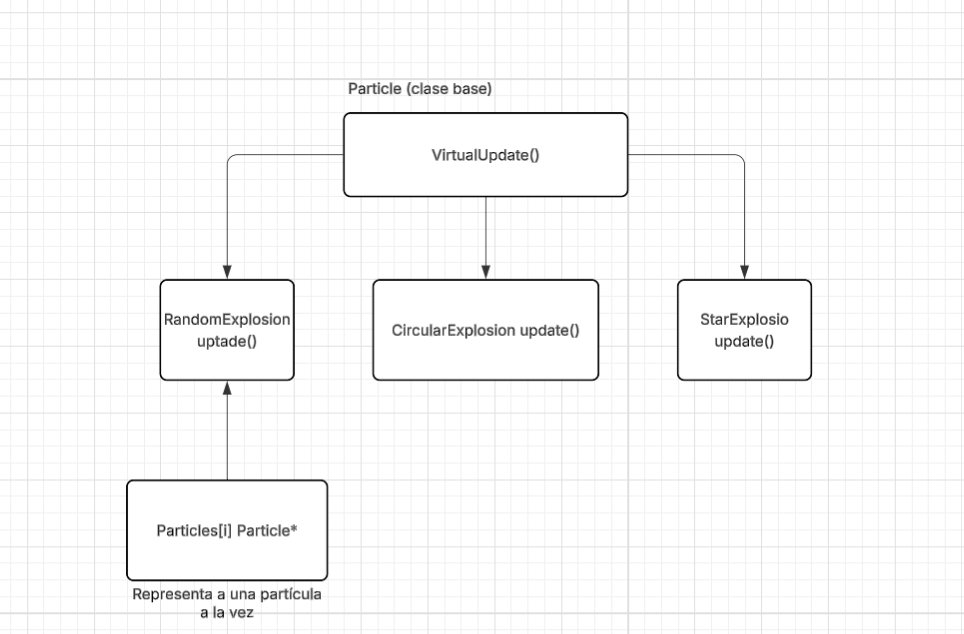

### **Código para analizar:**

```
    // Actualiza todas las partículas    
    for (int i = 0; i < particles.size(); i++) {        
		    particles[i]->update(dt);    
		    }
```
 (Explosión múltiple con barra espaciadora)

### **¿Qué puedes observar?**
Al depurar el código se observa que se está utilizando Particles, donde se accede a cada elemento por un puntero (particles[i]->update(dt)), lo que indica que todos los objetos manejan un mismo tipo de base aunque cada partícula puede ser de un tipo diferente, o sea, los diferentes tipos de explosiones.

### **¿Qué información te proporciona el depurador?**
El depurador se encarga de mostrar qué es lo que está pasando con el programa mientras se ejecuta, dejando ver sus variables, valores y cómo estas van cambiando en el breakpoint seleccionado.

### **Dibujo**


**Explicación:** 
1. Particle tiene método update().
2. Las otras clases lo sobrescriben, pero cada una de forma diferente.
3. particles[i] es el puntero tipo Particle*, pero en realidad apunta a diferentes objetos.

### **Conclusión:**
El polimorfismo permite que un método como update() se pueda comportar de diferentes maneras según el tipo de objeto. Esto sucede gracias a los métodos virtuales y la tabla de funciones virtuales (_vtable), que se encargan de llamar a la función correcta cuando se ejecuta el programa.

### **¿Qué relación existe entre los métodos virtuales y el polimorfismo?**
La relación es que gracias a los métodos virtuales es que existe el polimorfismo. Gracias a esto, un mismo método puede comportarde de forma diferente dependiento del tipo de objeto que lo esté utilizando.
