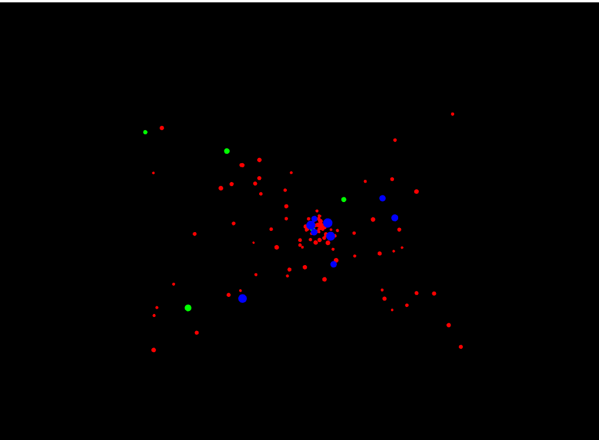
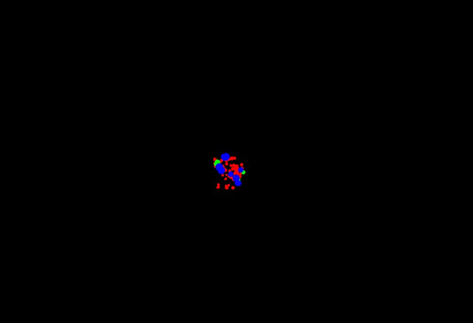
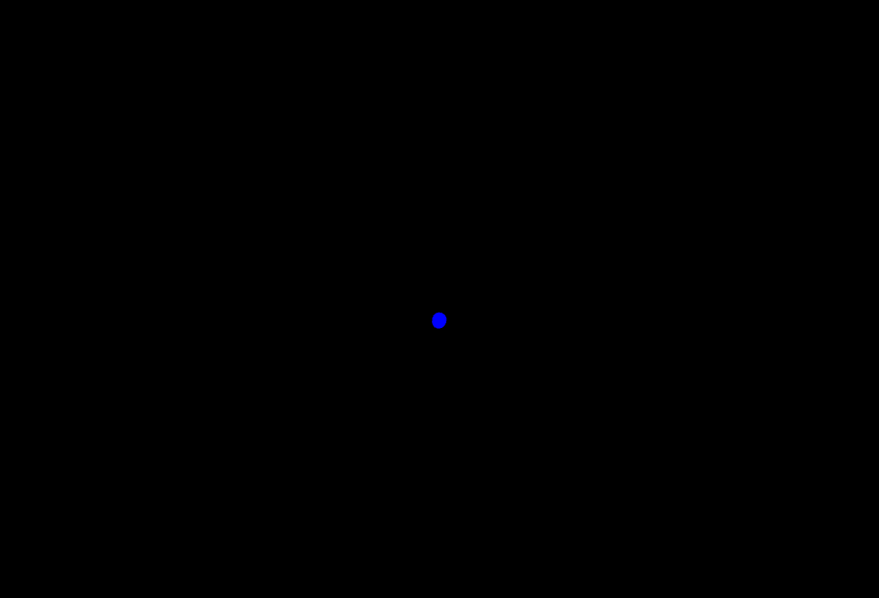
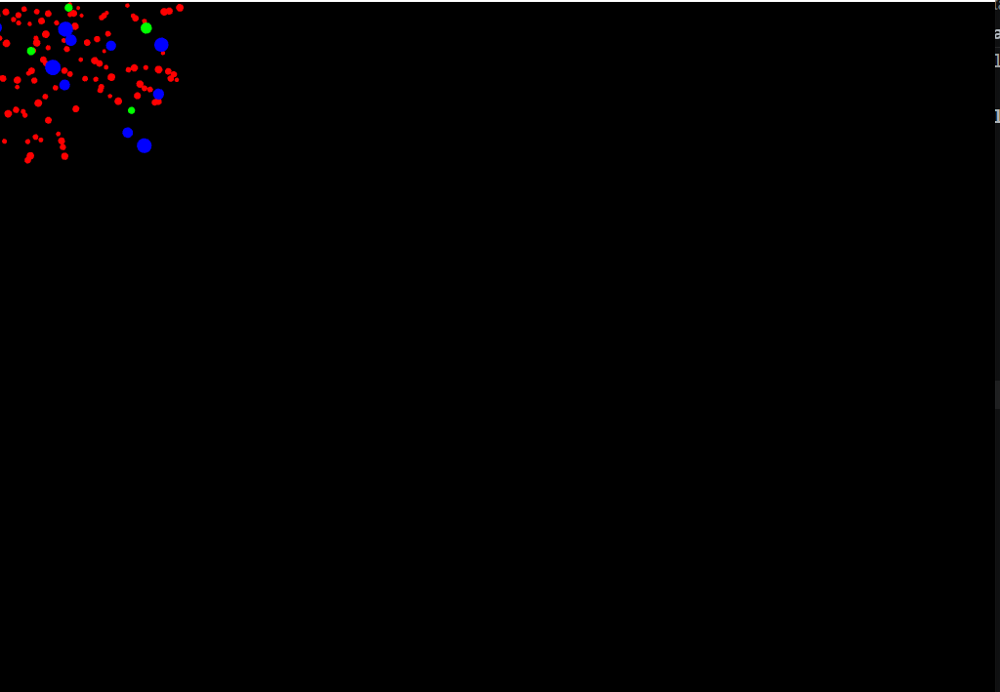
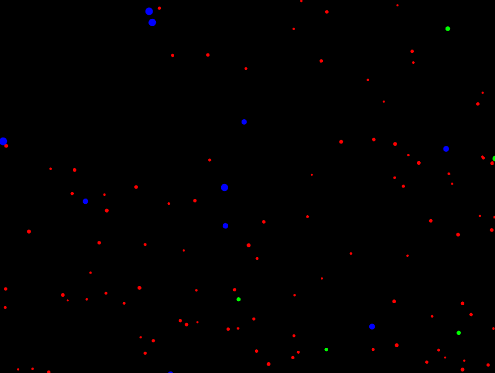

### **¿Cómo puedes interactuar con la aplicación? Menciona específicamente las teclas y qué efecto parecen tener sobre las partículas.**

Con la aplicación se puede interactuar de diferentes maneras:
- Con el mouse, las partículas se mueven a la dirección en la que se mueva el mouse, es como si sirviera como un imán.
- Al presionar la tecla A, las partículas se juntan hacia dentro a dónde apunte el mouse. Las partículas quedan todas juntas y ya no están esparcidas ampliamente por la ventana sino en un punto pequeño.
- Al presionar la tecla S, se para el funcionamiento de movimiento de las partículas y quedan congeladas en el punto en el que estaban antes de presionar la letra s.
- Al presionar la tecla R, las partículas se juntan hasta quedar una sola que se mueve a la dirección en que se mueva el mouse. 
- Al presionar la tecla N, las partículas regresan a su estado inicial, dominando toda la ventana y moviéndose en diferentes direcciones.

### **¿Observas los diferentes tipos de “partículas”? ¿Se comportan todas igual inicialmente?**

Las partículas tienen la misma forma circular pero cambian en su color que las divite en tres tipos de clase de partículas diferentes:

- Circular Roja: Son las partículas que más aparecen en pantalla, tienen un tamaño intermedio comparado con las otras partículas y su velocidad no es ni muy lenta ni muy rápida.
- Circular Azul: Son las partículas que tienen mayor tamaño, ya que son más grandes de las partículas rojas y verdes, hay como 10 partículas en total en toda la pantalla y se mueven a una velocidad lenta.
- Circular verde: Son como la combinación de las partículas azules y rojas en tamaño, las partículas más grandes se mueven a una velocidad lenta mientras que las pequeñas van a una velocidad super rápida, además de que son las partículas que más rápido se expanden en la ventana.

## **Toma algunas capturas de pantalla de la aplicación en diferentes momentos (estado inicial, después de presionar ‘a’, ‘r’, ‘s’, ‘n’) y añádelas a tu bitácora.**

Tecla "A": 

Tecla "R": 

Tecla "S": 

Tecla "N":
