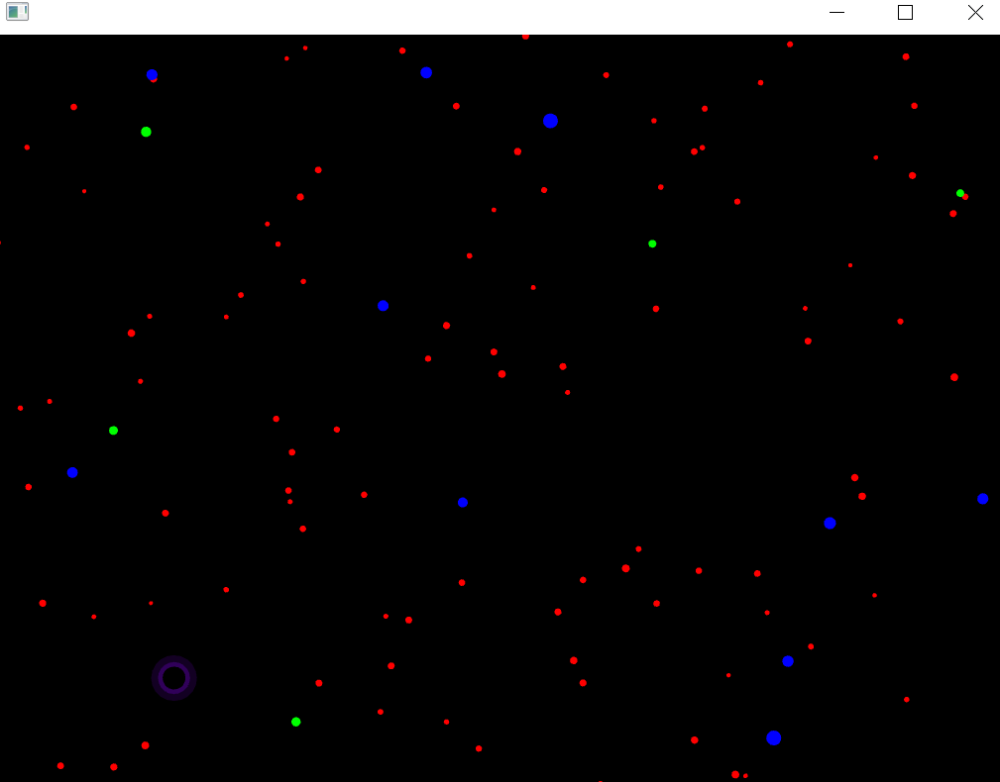
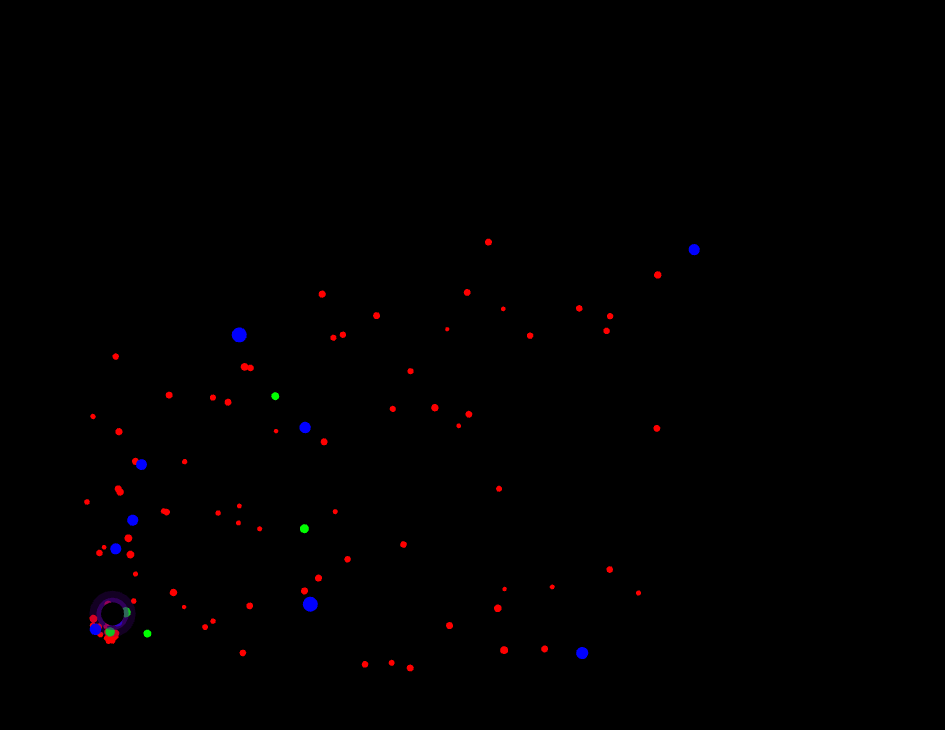
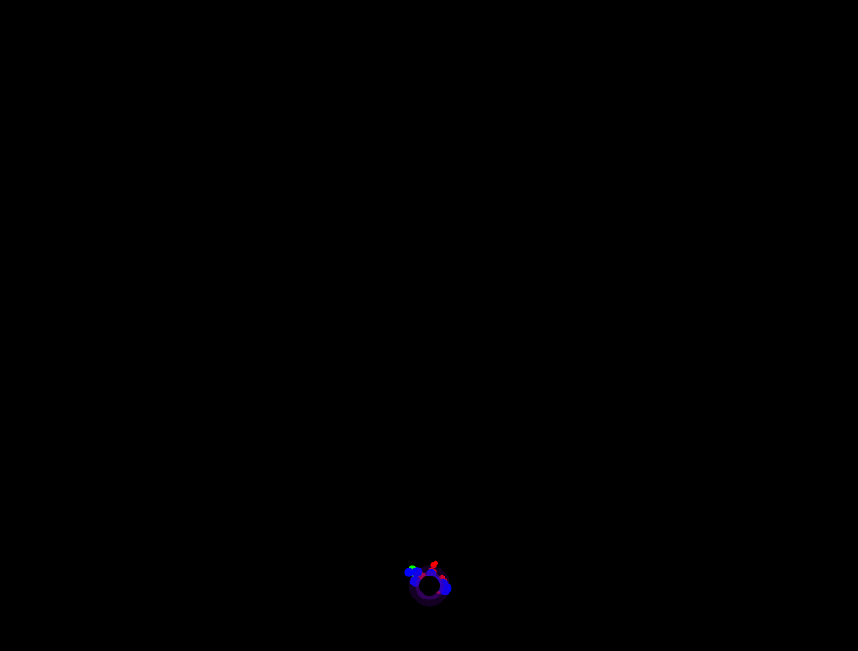

### **Explica cómo usaste el patrón Factory para esta nueva partícula.**

El patrón Factory se utilizó cuando se creó la nueva partívcula black_hole dentro del método createParticle. En createParticle es donde se definieron las características de la nueva partícula como su tamaño, color oscuro con glow y una velocidad lenta. De esta forma ofApp no necesita saber cómo se crea la partícula, sino que solo la solicita al factory.

```
for (int i = 0; i < 1; ++i) {
	Particle * p = ParticleFactory::createParticle("black_hole");
	particles.push_back(p);
	addObserver(p);
}
```

### **Describe cómo implementaste el patrón Observer para esta nueva partícula.**

El patrón Observer se utilizó cuando se registró a la partícula black_hole como un observer usando addObserver. Esto hace que la partícula reciba los eventos cuandos el usuario está presionando una tecla. En este caso, cuando se presiona la tecla "b", se envía el evento "absorb" y la partícula recibe el evento por medio del onNotify, donde reacciona y se cambia de estado. 

```
void ofApp::keyPressed(int key) {
	switch (key) {
	case 's':
		notify("stop");
		break;
	case 'a':
		notify("attract");
		break;
	case 'r':
		notify("repel");
		break;
	case 'n':
		notify("normal");
		break;
	case 'b':
		notify("absorb");
		break;
	default:
		break;
	}
}
```

### **Explica cómo aplicaste el patrón State a esta nueva partícula.**

El patrón State se utiliza cuando la partícula black_hole tiene la posibilidad de cambiar su comportamiento según el estado en que se encuentre. Además de los estados ya existentes (Stop, attract,repel, y normal), se creó un estado nuevo llamado AbsorbState, que hace que las partículas se muevan hacia la partícula black_hole simulando una absorción.  
Cuando la partícula recibe el estado absorb, cambia a este estado usando setState, demostranque que se pueden añadir nuevos estados sin modificar la estructura principal del código.

```
void AbsorbState::update(Particle* particle) {
	//Posición del mouse que simula el centro de absorción
	ofVec2f mouse(ofGetMouseX(), ofGetMouseY());

	//Dirección hacia el mouse
	ofVec2f dir = mouse - particle->position;
	float len = dir.length();

	if (len > 1e-6f) {
		dir /= len;

		//Atracción fuerte
		particle->velocity += dir * 0.2f;
	}

	//Limitar velocidad
	particle->velocity.limit(5.0f);

	//Mover
	particle->position += particle->velocity * 0.3f;
}
```

### **EVIDENCIAS**
Partícula black_hole


State absorb:

