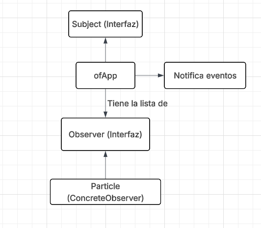
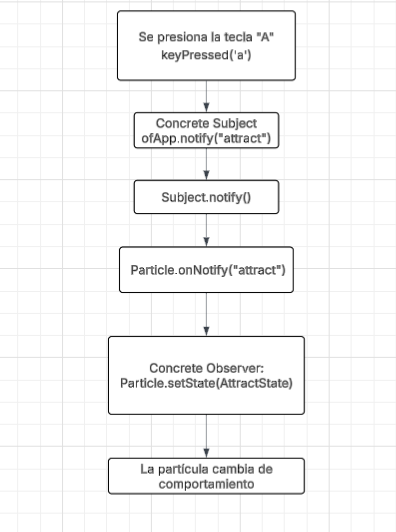

### **1. Explica con tus propias palabras el propósito del patrón Observer. ¿Qué problema resuelve?**

El patrón Observer sirve para que un objeto le avise a muchos otros cuando ocurre algo, sin tener que conocerlos directamente.

**Problemas que resuelve:**

1. Evita que un objeto tenga que controlar manualmente a todos los demás.

2. Reduce el grado de dependencia entre clases u objetos.

### **2. Dibuja un diagrama que muestre la relación entre Subject, Observer, ofApp y Particle en el caso de estudio, indicando quién es el Sujeto y quiénes los Observadores.**

### **3. Construye un diagrama de secuencia que muestre cómo funciona el patrón Observer al presionar una tecla..**

Ejemplo presionando la tecla "A":

### **4. ¿Qué ventajas crees que ofrece usar el patrón Observer en esta aplicación en comparación con, por ejemplo, que ofApp::update recorriera todas las partículas y les dijera directamente que cambien su comportamiento basado en una variable global?** 

- ofApp no necesita conocer los detalles de la clase Particle sino que solo envía los eventos.

- Se pueden agregar varias clases tipo Observer sin tener que cambiar ofApp.

- Cada partícula puede decidir cómo reaccionar a la acción que mandó el Subject de manera diferente.

Si ofApp::update() controlara todo:

- Habrían muchos if dentro de la app.

- El código sería más difícil de mantener y sería muy acoplado.
