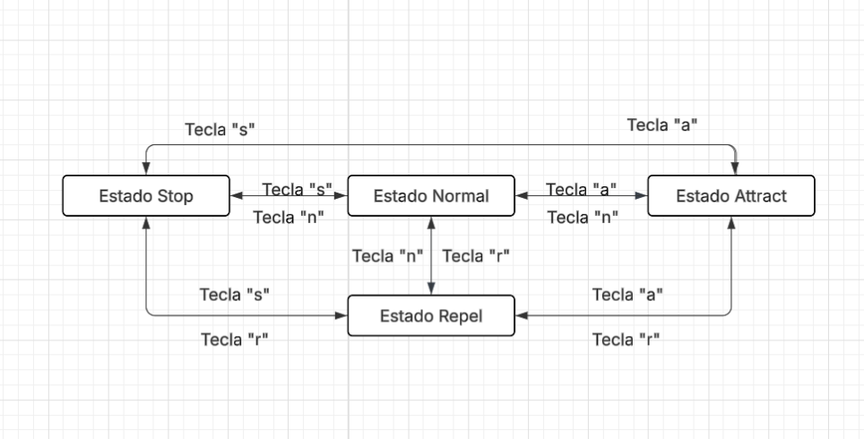

### **1. Explica con tus propias palabras el propósito del patrón State. ¿Cuándo es útil aplicarlo?**

El patrón State sirve para que un objeto (En este caso las partículas) pueda cambiar su comportamiento según el estado en el que se encuentra, sin tener que utilizar muchos if o switch.

### **2.  Dibuja un diagrama de estados simple para la clase Particle. Muestra los diferentes estados (Normal, Attract, Repel, Stop) como nodos y las transiciones entre ellos como flechas etiquetadas con el evento que las causa (p. ej., la tecla presionada: ‘n’, ‘a’, ‘r’, ‘s’).**

### **3. Describe las ventajas de usar el patrón State en Particle en lugar de tener un miembro std::string estadoActual y usar un gran if/else if/else o switch dentro de Particle::update() para cambiar el comportamiento.**

