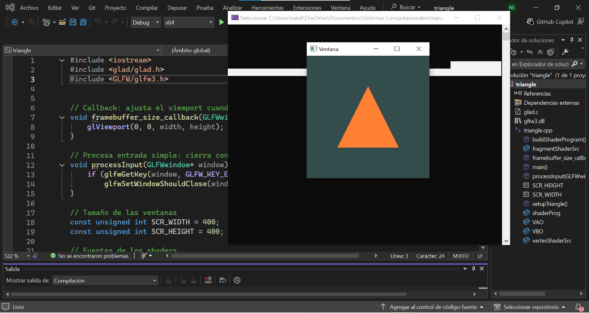

1. 

### **¿Qué preguntas te surgen al ver el código?**

- ¿Por qué no hay un ofApp.h?
- ¿Qué es lo que hace el shader en el código?
- ¿Qué son los ID locales y para qué sirven?
- ¿Qué es el VAO y el VBO?
- ¿Qué es un framebuffer?
- ¿Qué es glad?
- ¿Qué es el V-Sync?
