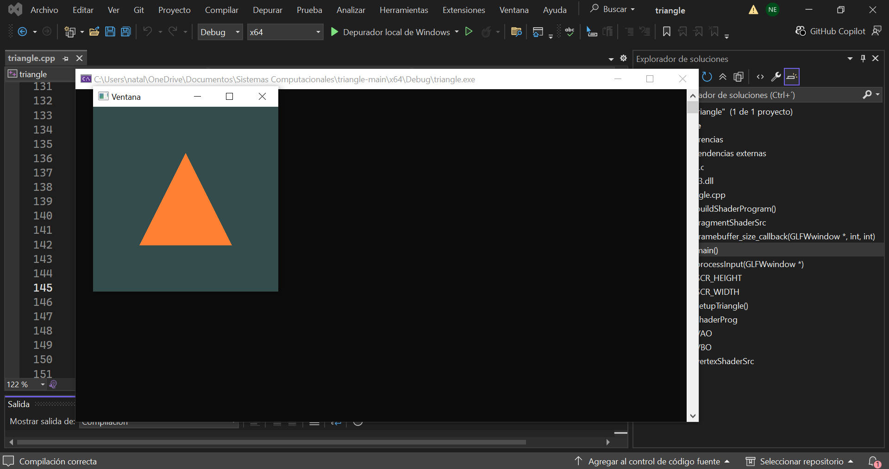
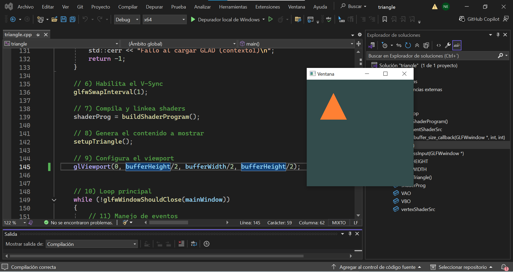
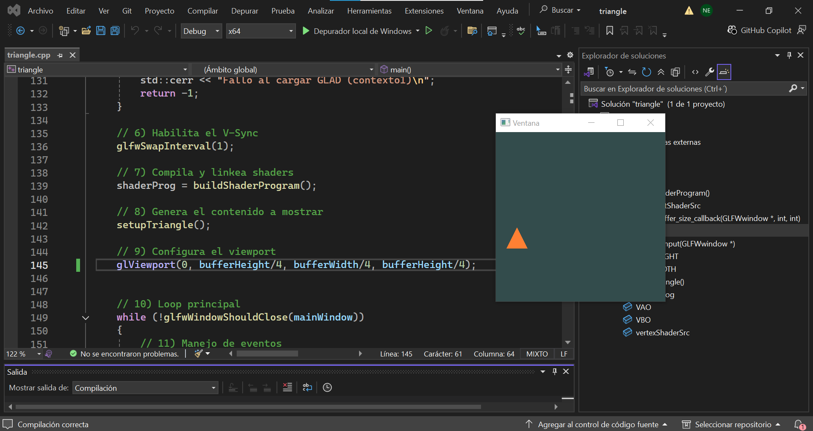

### **¿Qué pasa, ¿Qué observas? ¿Qué crees que está pasando?  si se cambian los valores de bufferWidth y bufferHeigth?**
Al cambiar los valores del bufferwidth y el bufferheight se modifica la ventana del área donde se encuentra el triángulo. 

Si el ancho y el largo del área se dividen, el triángulo se ve más reducido en la parte de la pantalla, pero si se multiplican, el dibujo del triángulo se ve más grande,  estirado o cortado en la ventana.

- Multiplicado por 2

- Multiplicado por 4

- Dividido por 2

- Dividido por 4

