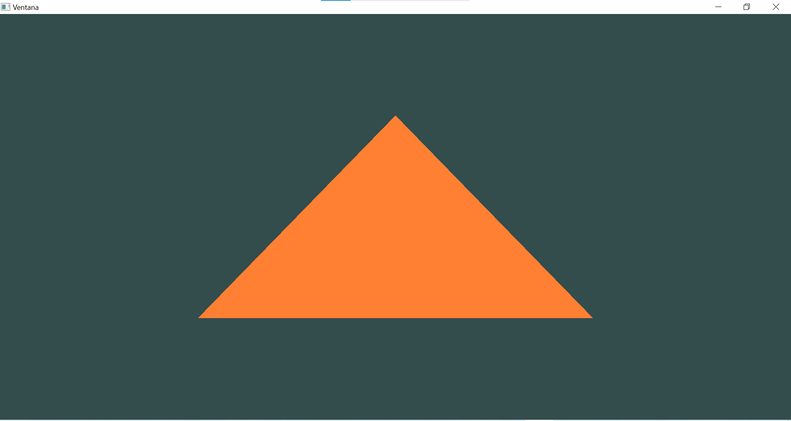
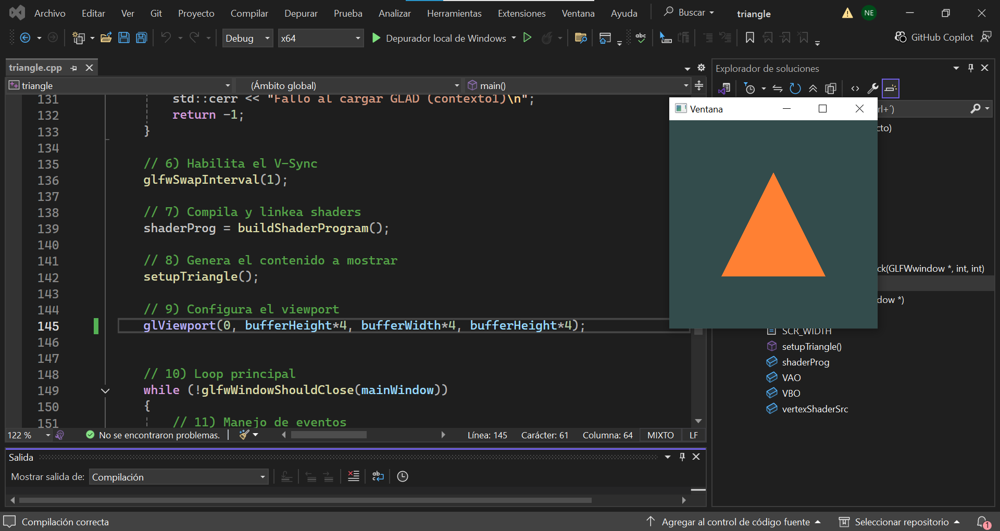
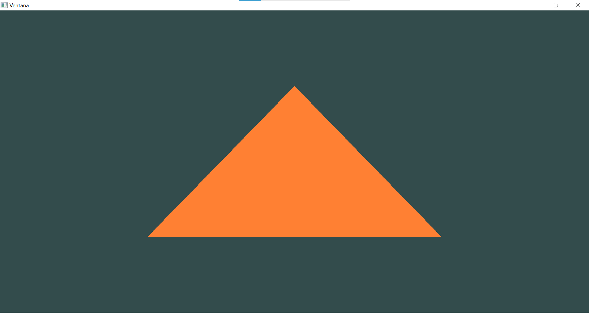
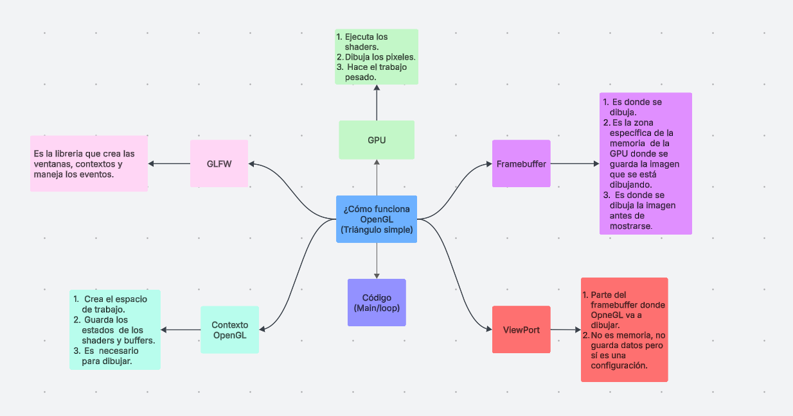
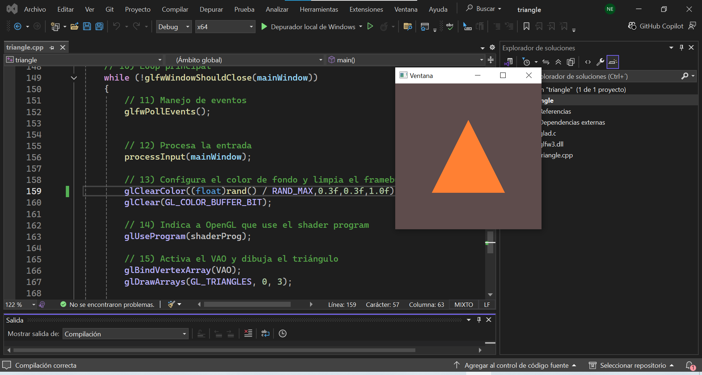
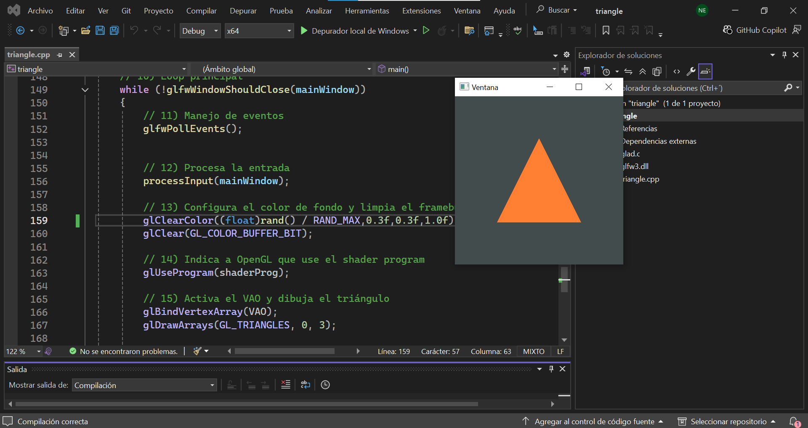
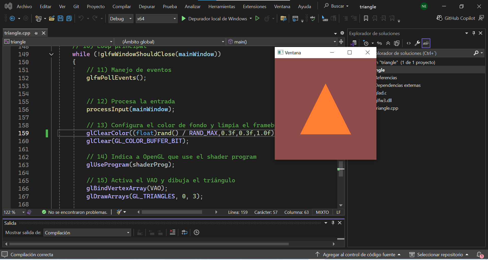
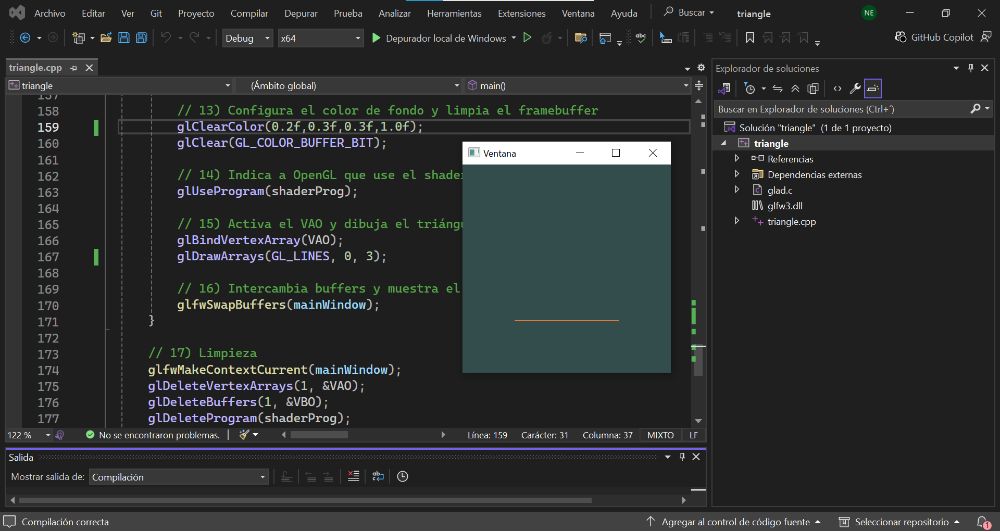
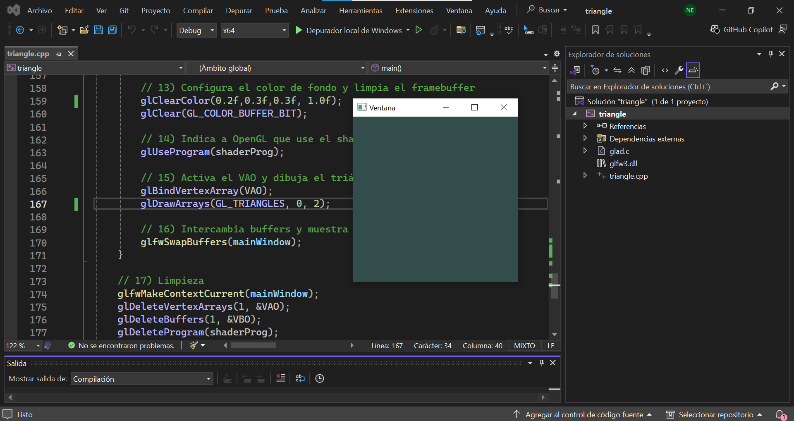
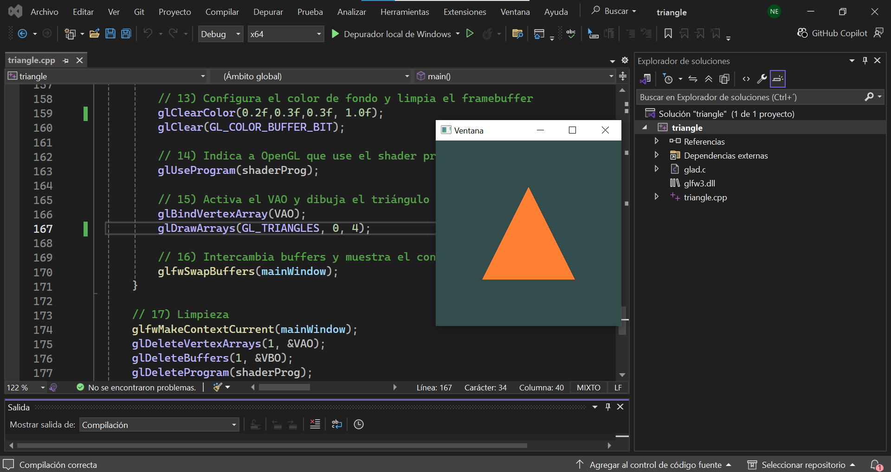

### **¿Qué pasa, ¿Qué observas? ¿Qué crees que está pasando?  si se cambian los valores de bufferWidth y bufferHeigth?**
Al cambiar los valores del bufferwidth y el bufferheight se modifica la ventana del área donde se encuentra el triángulo. 

Si el ancho y el largo del área se dividen, el triángulo se ve más reducido en la parte de la pantalla, pero si se multiplican, el dibujo del triángulo se ve más grande,  estirado o cortado en la ventana.

- Multiplicado por 2

- Multiplicado por 4

- Dividido por 2

- Dividido por 4

### **Mapa Mental**

### **¿Qué pasaría si cambio el valor del color en glClearColor()?**

Cuando se cambia el color de fondo en cada frame usando números aleatorios, color de la ventana cambia constantemente como si la ventana tuviera un lag al cargar correctamente los colores.

Esto muestra que el framebuffer se limpia en cada iteración del loop con el nuevo color definido. También me di cuenta que los colores deben estar entre un valor de 0.0 y 0.1 para que OpenGL los interprete correctamente.

### **¿Qué pasaría si se cambia el primer parámetro de glDrawArrays a GL_LINES?**

Al cambiar el parámetro glDrawArrays a GL_LINES, lo que hace OpenGL es que ya no interpreta los vértices creados como un triángulo sino que ahora los interpreta como una línea

### **¿Qué pasaría si lo pasa a GL_POINTS?**

Cuando se hace el cambio de código a GL_POINTS, OpenGL interpreta cada vértice como si fueran puntos individuales. Como en el caso del triángulo hay 3 vértices, se muestran esos 3 puntos en las posiciones donde se formaría el triángulo, pero no se conectan entre sí.

### **¿Qué pasa si cambias el tercer parámetro a 2?**

Para este experimento volví a colocar el GL_TRIANGLES pero cambié el número de vértices por dibujar a 2, lo que hace que OpenGl no pueda dibujar el triángulo porque necesita 3 vértices para hacerlo. Por ese motivo no se ve nada en pantalla cuando se le da ejecutar al programa

### **¿Qué pasa si lo cambias a 4?**

Lo que sucede al cambiar el GL_TRIANGLES a 4 vértices es que se forma el triángulo con los primeros 3 vértices y deja el 4to vértice sin utilizar. Esto demuestra que OpenGL procesa los vértices en grupos según el modod dibujo y descarta los vértices o puntos que no completan una figura.

