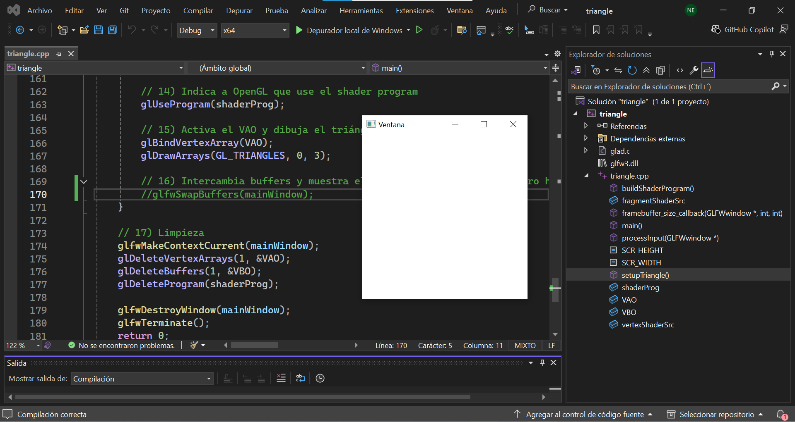

### **1. ¿Qué es el contexto OpenGL?**

El contexto OpenGl es como el espacio de trabajo donde se guarda todo lo que se necesita para que funcione el programa como los shaders, buffers y configuraciones. Sin esta información inicial de contexto, las funciones de OpenGL no sabrían en donde dibujar.

### **2. ¿Cuál es el rol de la biblioteca GLFW y qué ventaja tiene usarla?**

La biblioteca GLFW es el que se encarga de crear la ventana, manejar los eventos y crear el contexto de OpenGL. La ventaja es que es una biblioteca que ayuda a simplificar todo el proceso y puede funcionar con varios sistemas operativos.

### **3. ¿Por qué crees que OpenGL necesita un contexto?**

Porque OpenGL necesita tener un espacio donde trabajar y sin ese espacio no tendría donde guardar sus herramientas ni en dónde hacer su trabajo. OpenGl necesita del contexto para poder dibujar.

### **4. ¿En últimas qué será el framebuffer y a qué te recuerda de las dos primeras unidades del curso?**

El frameBuffer es una zona de memoria donde la GPU dibuja la imagen antes de que se muestre en pantalla. Es como un lienzo donde se construye una imagen paso a paso antes de verla.

### **5. ¿Qué relación hay entre en el viewport y el framebuffer?**

El framebuffer es todo el área donde es posible dibujar mientras que el viewport es la parte específica de esa área de dibujo donde realmente se dibuja. Es como tener una hoja completa y decidir dibujar solo en una porción de ella.

### **6. ¿En todo la analizado hasta ahora qué rol juega los drivers de la GPU y la GPU misma?**

El rol de la GPU es el de verdaderamente hacer el dibujo que se necesita, ejecuta los shaders y procesa los datos. 

Los drivers son los que permiten la comunicación entre el OpenGL y la GPU, trabaja como un intermediario.

### **7. ¿Por qué crees que sea necesario activar el VSync? ¿Si no lo activas y la imagen es estática qué crees que pase, y si es dinámica?**

Es VSync se activa para que los frames se sincronicen con la pantalla para que la imagen no se vea cortada.

- Si la imagen es estátican, no se nota mucho si el VSync está activado o no.
- Si la imagen no es estática y no cuenta con el VSync activado, puede que aparezcan cortes o movimientos extraños en la imagen.

### **8. ¿Qué es OpenGL Legacy? ¿Qué diferencias hay entre ambos?**

OpenGL Legacy es la versión antigua de OpenGL que utilizaba funciones más simples pero menos eficientes.

El OpenGL moderno usa los shaders, buffers y es más flexible pero más complejo de utilizar.

### **9. ¿Qué es el shader program? ¿Por qué es importante en OpenGL moderno?**

El shader program es el que define como se dibujan los objetos en la GPU.

Es importante en el OpenGL moderno porque este depende de los shaders para poder renderizar las imágenes.

### **10.  Trata de revisar el código setupTriangle(), intuitivamente ¿Qué crees que hace? ¿Qué crees que es el VAO y el VBO?**

setupTriangle() en el código es el encargado de crear las coordenas de los 3 vértices que se necesitan para crear el triángulo. 

- El VAO es el encargado de guardar los datos o coordenadas dadas de los vértices del triángulo.
- El VBO organiza cómo se interpretan los datos del VAO.

### **11. En el ciclo principal (game loop) de OpenGL, notaste que en cada frame (cuadro) le decimos a openGL que use el shader program y el VAO. Si le indicas esto antes del game loop ¿Será necesario seguirlo haciendo en cada loop? Si no es necesario ¿En qué casos crees que esto puede ser útil?**

No siempre es necesario usar el shader program y el VAO en un loop si no cambian, ya que OpenGL mantiene los estados activos. Pero se suele hacer el loop porque cuando se trata de programas más complejos que cuentan con varios objetos o shaders se hacen varios cambios constantes. Gracias al loop es que se asegura que se esté usando la configuración correcta en cada frame.

### **12.  Finalmente, recuerda lo que hace glfwSwapBuffers(mainWindow); ¿Por qué crees que es importante? ¿Qué pasaría si no lo llamas? ¿Cómo explicas lo que pasa si no lo llamas?**

el glfwSwapBuffers(mainWindow) es importante porque es el que se encarga de mostrar lo que se dibujo en el framebuffer en pantalla.

En el experimento se puede ver que si no se llama al glfwSwapBuffers, la imagen no se actualiza y se ve como si no hubiera nada en pantalla. Esto sucede cuando se usa el doblebuffer porque un buffer se encarga de dibujar y el otro se encarga de mostrar el dibujo en pantalla pero al no intercambiarse, los procesos u operaciones matemáticas que se utilizaron para realizar el dibujo no tienen en dónde mostrarse.

**Experimento no llamar al glfwSwapBuffers**

