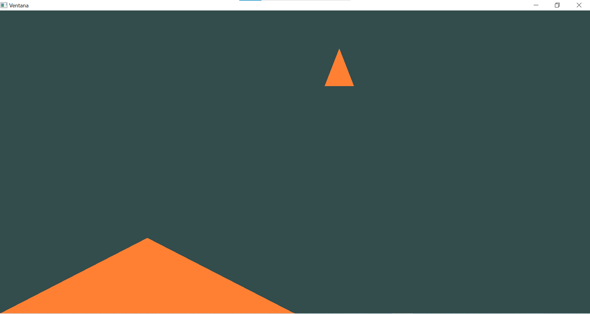
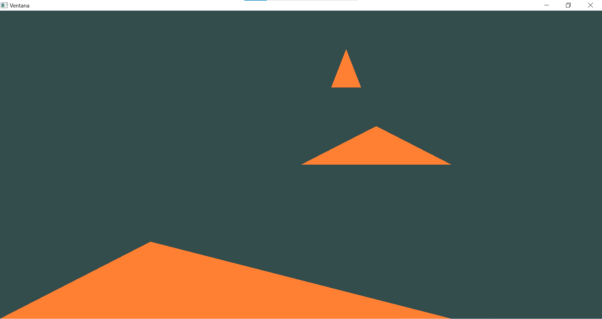

### **PREDICCIÓN:**

Creo que con el ejercicio se crearán tres triángulos diferentes que van a tener como guía los datos y coordenadas dadas por los shaders.

### **Nuevo código main()**
```
#include <iostream>
#include <glad/glad.h>
#include <GLFW/glfw3.h>


// Callback: ajusta el viewport cuando cambie el tamaño de la ventana
void framebuffer_size_callback(GLFWwindow* window, int width, int height) {
	glViewport(0, 0, width, height);
}

// Procesa entrada simple: cierra con ESC
void processInput(GLFWwindow* window) {
	if (glfwGetKey(window, GLFW_KEY_ESCAPE) == GLFW_PRESS)
		glfwSetWindowShouldClose(window, true);
}

// Tamaño de las ventanas
const unsigned int SCR_WIDTH = 400;
const unsigned int SCR_HEIGHT = 400;

// Fuentes de los shaders
const char* vertexShaderA = R"glsl(
    #version 460 core
    layout(location = 0) in vec3 aPos; 
    void main() {
        gl_Position = vec4(aPos, 1.0);
    }
)glsl";

const char* vertexShaderB = R"glsl(
#version 460 core
layout(location = 1) in vec3 aColor;

void main() {
    gl_Position = vec4(aColor * 0.5, 1.0);
}
)glsl";

const char* vertexShaderC = R"glsl(
#version 460 core
layout(location = 2) in vec2 aOffset;

void main() {
    gl_Position = vec4(aOffset, 0.0, 1.0);
}
)glsl";

const char* fragmentShaderSrc = R"glsl(
    #version 460 core
    out vec4 FragColor;
    void main() {
        FragColor = vec4(1.0, 0.5, 0.2, 1.0);
    }
)glsl";


// IDs globales
unsigned int VAO, VBO;
unsigned int shaderProg;
unsigned int shaderA;
unsigned int shaderB;
unsigned int shaderC;

// Compila y linkea un programa de shaders, retorna su ID
unsigned int buildShaderProgram(const char* vertexShaderCode) {
	int success;
	char log[512];

	unsigned int vs = glCreateShader(GL_VERTEX_SHADER);
	glShaderSource(vs, 1, &vertexShaderCode, nullptr);
	glCompileShader(vs);
	glGetShaderiv(vs, GL_COMPILE_STATUS, &success);
	if (!success) {
		glGetShaderInfoLog(vs, 512, nullptr, log);
		std::cerr << "ERROR VERTEX SHADER:\n" << log << "\n";
	}

	unsigned int fs = glCreateShader(GL_FRAGMENT_SHADER);
	glShaderSource(fs, 1, &fragmentShaderSrc, nullptr);
	glCompileShader(fs);
	glGetShaderiv(fs, GL_COMPILE_STATUS, &success);
	if (!success) {
		glGetShaderInfoLog(fs, 512, nullptr, log);
		std::cerr << "ERROR FRAGMENT SHADER:\n" << log << "\n";
	}

	unsigned int prog = glCreateProgram();
	glAttachShader(prog, vs);
	glAttachShader(prog, fs);
	glLinkProgram(prog);
	glGetProgramiv(prog, GL_LINK_STATUS, &success);
	if (!success) {
		glGetProgramInfoLog(prog, 512, nullptr, log);
		std::cerr << "ERROR LINKING PROGRAM:\n" << log << "\n";
	}

	glDeleteShader(vs);
	glDeleteShader(fs);
	return prog;
}

// Crea un VAO/VBO con los datos de un triángulo
void setupTriangle() {
	float vertices[] = {
		//Posición, color y offset
		-1.0f, -1.0f, 0.0f,  0.0f,0.0f,0.0f,  0.1f,0.5f,
		 0.0f, -1.0f, 0.0f,  1.0f,0.0f,0.0f,  0.2f,0.5f,
		-0.5f, -0.5f, 0.0f,  0.5f,0.5f,0.0f,  0.15f,0.75f,
	};
	glGenVertexArrays(1, &VAO);
	glGenBuffers(1, &VBO);

	glBindVertexArray(VAO);
	glBindBuffer(GL_ARRAY_BUFFER, VBO);
	glBufferData(GL_ARRAY_BUFFER, sizeof(vertices), vertices, GL_STATIC_DRAW);
	//Atributo 0: Posición
	glVertexAttribPointer(0, 3, GL_FLOAT, GL_FALSE, 8 * sizeof(float), (void*)(0));
	glEnableVertexAttribArray(0);
	//Atributo 1: Color
	glVertexAttribPointer(1, 3, GL_FLOAT, GL_FALSE, 8 * sizeof(float), (void*)(3 * sizeof(float)));
	glEnableVertexAttribArray(1);
	//Atributo 2: Offset
	glVertexAttribPointer(2, 2, GL_FLOAT, GL_FALSE, 8 * sizeof(float), (void*)(6 * sizeof(float)));
	glEnableVertexAttribArray(2);
	
	glBindVertexArray(0);
}


int main()
{
	// 1 Inicializa la biblioteca GLFW para crear la ventana y manejar eventos como el teclado, el mouse o cambios de tamaño
	if (!glfwInit()) { 
		std::cerr << "Fallo al inicializar GLFW\n";
		return -1;
	}
	//GLFW debe inicializarse antes de usar cualquier función
	glfwWindowHint(GLFW_CONTEXT_VERSION_MAJOR, 4);
	glfwWindowHint(GLFW_CONTEXT_VERSION_MINOR, 6);
	glfwWindowHint(GLFW_OPENGL_PROFILE, GLFW_OPENGL_CORE_PROFILE);

	// 2 Crear ventana, el contexto que se utiliza para dibujar con OpenGl
	GLFWwindow* mainWindow = glfwCreateWindow(SCR_WIDTH, SCR_HEIGHT, "Ventana", nullptr, nullptr);
	if (!mainWindow) {
		std::cerr << "Error creando ventana1\n";
		glfwTerminate();
		return -1;
	}

	// 3 Lee el tamaño del framebuffer
	int bufferWidth, bufferHeight;
	glfwGetFramebufferSize(mainWindow, &bufferWidth, &bufferHeight);
	
	// 4 Callbacks 
	glfwSetFramebufferSizeCallback(mainWindow, framebuffer_size_callback);


	// 5 Cargar GLAD y recursos en contexto de window1, hace que GLFW d
	glfwMakeContextCurrent(mainWindow);

	if (!gladLoadGLLoader((GLADloadproc)glfwGetProcAddress)) { //GLAD es la biblioteca que se encarga de cargar las funciones del OpenGL y hacer que funcionen en el programa 
		std::cerr << "Fallo al cargar GLAD (contexto1)\n";
		return -1;
	}

	// 6 Habilita el V-Sync, tasa de refresco
	glfwSwapInterval(1);

	// 7 Compila y linkea shaders, sin los Shaders OpenGL no sabe dibujar
	shaderA = buildShaderProgram(vertexShaderA);
	shaderB = buildShaderProgram(vertexShaderB);
	shaderC = buildShaderProgram(vertexShaderC);

	// 8 Genera el contenido a mostrar
	setupTriangle(); //Define cómo se verá el triángulo en pantalla

	// 9 Configura el viewport
	glViewport(0, 0, bufferWidth, bufferHeight);


	// 10 Loop principal
	while (!glfwWindowShouldClose(mainWindow)) //Es donde se procesan los eventos, se actualiza la lógica del programa y se dibuja la escena.
	{
		// 11 Manejo de eventos
		glfwPollEvents();

	
		// 12 Procesa la entrada
		processInput(mainWindow);

		// 13 Configura el color de fondo y limpia el framebuffer
		glClearColor(0.2f,0.3f,0.3f, 1.0f);
		glClear(GL_COLOR_BUFFER_BIT);
		
	   // 14 Activa el VAO
		glBindVertexArray(VAO);

	   // Shader A: Posición
		glUseProgram(shaderA);
		//Activa el atributo 0 (posición)
		glEnableVertexAttribArray(0);
		// Desactivar color y offset
		glDisableVertexAttribArray(1);
		glDisableVertexAttribArray(2);
		// Dibuja
		glDrawArrays(GL_TRIANGLES, 0, 3);

		// Shader B: Color
		//Usar el shaderB
		glUseProgram(shaderB);
		//Desactiva posición
		glDisableVertexAttribArray(0);
		//Activa solo el color
		glDisableVertexAttribArray(1);
		//Desactiva offset
		glDisableVertexAttribArray(2);
		//Dibuja
		glDrawArrays(GL_TRIANGLES, 0, 3);

		//Shader C: Offset
		//Usa el shader C
		glUseProgram(shaderC);
		//Desactiva posición y color
		glDisableVertexAttribArray(0);
		glDisableVertexAttribArray(1);
		//Activa solo el Offset
		glEnableVertexAttribArray(2);
		//Dibuja
		glDrawArrays(GL_TRIANGLES, 0, 3);

		// 16 Intercambia buffers y muestra el contenido, el  buffer trasero hace los cálculos para realizar el dibujo y el delantero muestra el dibujo realizado.
		glfwSwapBuffers(mainWindow);
	}

	// 17 Limpieza
	glfwMakeContextCurrent(mainWindow);
	glDeleteVertexArrays(1, &VAO);
	glDeleteBuffers(1, &VBO);
	glDeleteProgram(shaderProg);

	glfwDestroyWindow(mainWindow);
	glfwTerminate();
	return 0;
}
```

### **EVIDENCIA**
 

 **Conclusión:**

 Al principio no aparecía el tercer triángulo porque los atributos de los shaders se activaban y desactivaban dinámicamente, pero al solucionar este problema ya si aparecieron los 3.

 