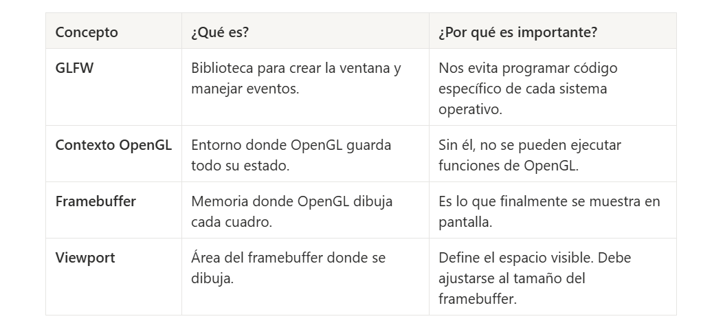

Shaders: Modifican los vertex y los fragments.

Uniforms: Permiten cambiar los datos dinámicos desde c++ a los shaders.

GLFW: Biblioteca que permite crear ventanas y manejar eventos de entrada (teclado, ratón, ect)

Shaders: Son pequeños programas de instrucciones que se ejecutan en la GPU y le dicen a OpenGL cómo se dibuja algo.

- Fragment Shader: Se encargan de decidir el color de cada pixel.

Buffers: Son contenedores o arreglos de datos dentro del GPU donde se guardan datos. Datos que se procesan.

- Vertex Buffer: Guarda coordenadas.

- Vetex Array: Cómo están configuardas las coordenadas, es la información/atributos que contiene cada vértice para poderse dibujar.

- Frame buffer: Información de lo que se va a pintar en pantalla.Porción de memoria donde OpenGL dibuja los pixeles antes de enviarlos a la pantalla.

Hilo: Flujo de instrucciones del programa 

GLAD: Busca las funciones a utilizar en los drivers.

- API: Interfaz de programación que permite el acceso a funciones. Conjunto de funciones que permite interactuar con el sistema.

- La GPU es la que realmente dibuja, mientras que OpenGL es la API que le dice a la GPU qué y cómo dibujar.

- Viewport: Define que parte del framebuffer se usará para dibujar.

OPENGL GUARDA ESTADOS!

Objetos: Son entidades que representan recursos gráficos como texturas, buffers de vértices, shaders y otros elementos necesarios para renderizar gráficos en la GPU.